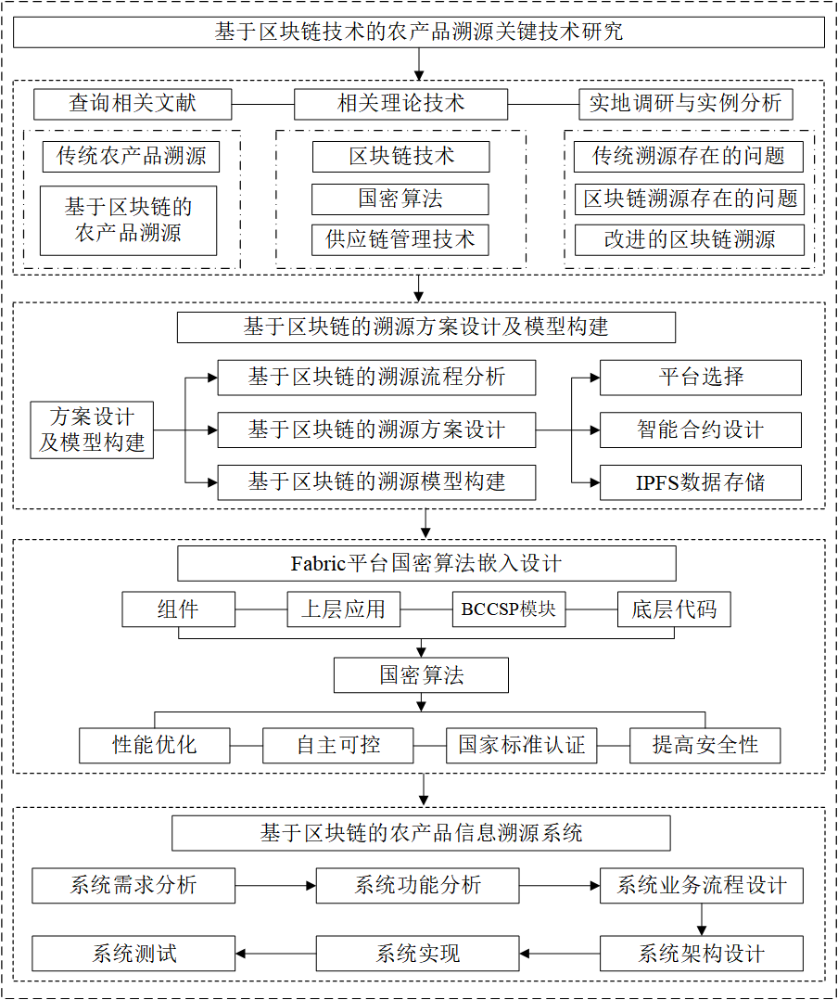
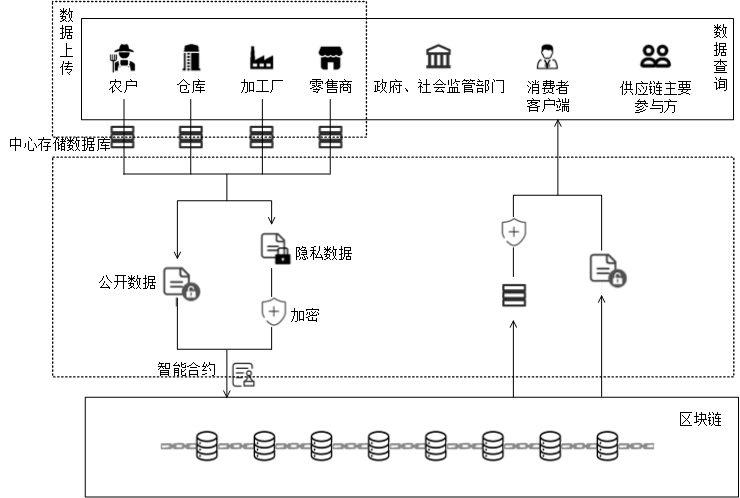
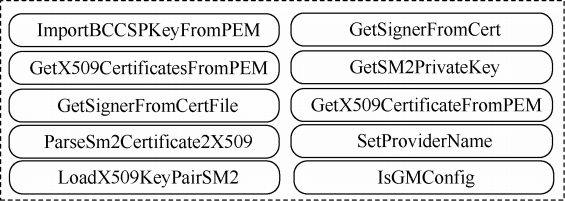
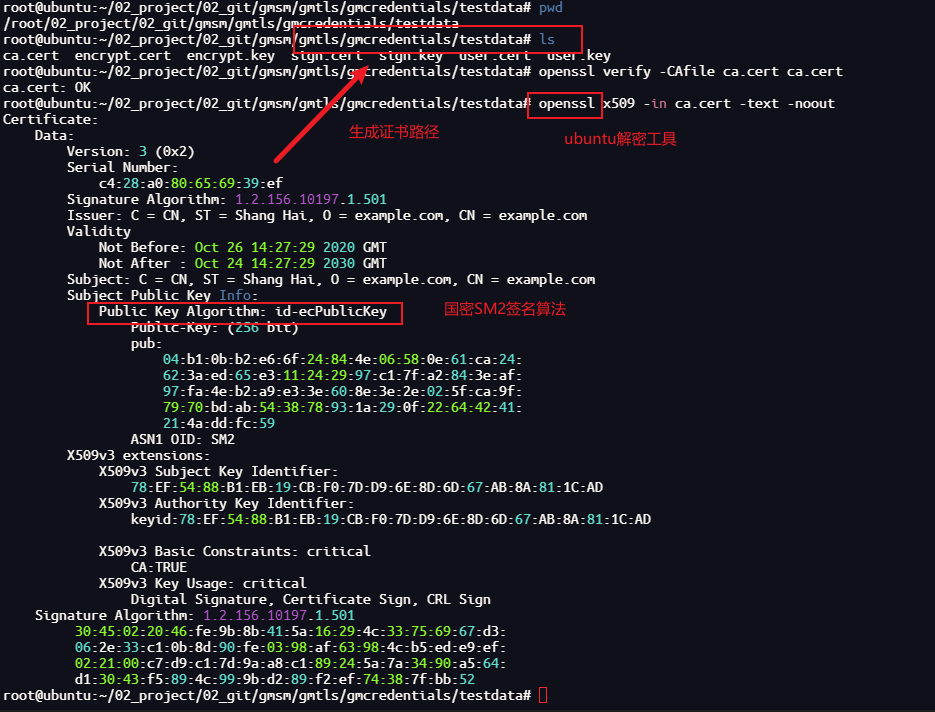
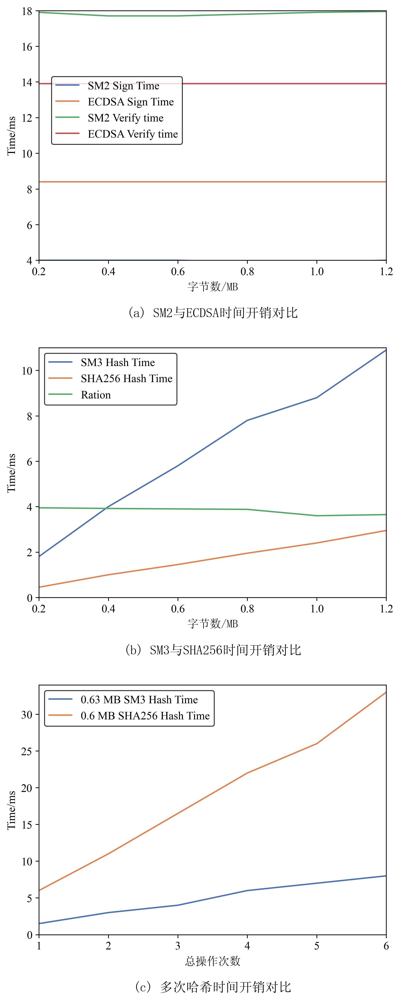
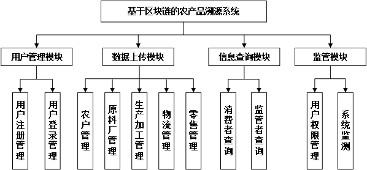
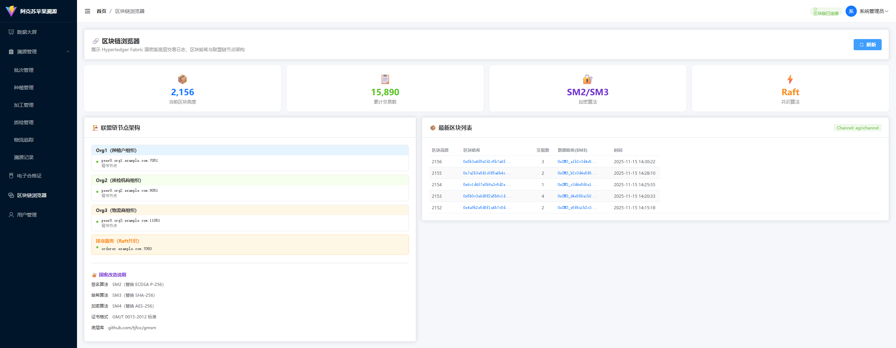

# 幻灯片 1：封面

**主标题**：基于区块链技术的农产品溯源关键技术研究
**副标题**：塔里木大学研究生中期考核汇报
**汇报人**：柏小康
**学号**：10757232282
**专业**：农业工程与信息技术
**导师**：张楠楠 教授
**考核日期**：2025年12月14日

# 幻灯片 2：汇报目录

**CONTENT**

1.  **研究内容概述** 
2.  **研究工作进展** 
3.  **阶段性成果**
4.  **存在问题与解决措施** 
5.  **下一步研究计划** 

---

# 幻灯片 3：基本情况简述

<!-- 布局：左右布局，左侧为文字，右侧可以留白或放校徽 -->

**个人基本情况**

*   **课程学习**：已完成培养方案规定的全部课程，修满 **28.0** 学分，加权平均分 **81.8**。
*   **思想品德**：思想政治坚定，恪守学术道德，无任何学术不端行为。
*   **专业实践**：在新疆数字兵团信息产业发展有限责任公司完成6个月专业实践，深度参与区块链项目研发。

---

# 幻灯片 4：一、研究内容概述

<!-- 布局：左文右图 -->

**1.1 研究背景与对象**
*   **应用背景**：以新疆特色农产品——**阿克苏苹果**为具体研究对象，针对其供应链长、假冒伪劣频发、品牌保护难等痛点。
*   **标准依据**：系统设计严格遵循国家标准 **《GB/T 29373-2012 农产品追溯要求 果蔬》**，确保溯源信息的规范性与通用性。

**1.2 研究目标**

*   构建基于 **Hyperledger Fabric** 联盟链的溯源体系。
*   攻克 **国密算法（SM系列）** 在区块链底层的适配难题。
*   解决海量多媒体数据存储瓶颈（**IPFS**）。

<small>图：符合国标要求的农产品全流程溯源逻辑</small>

---

# 幻灯片 5：二、研究工作进展

**本章节将从以下三个维度汇报：**

1.  **顶层设计**：技术路线与架构模型
2.  **核心攻关**：国密算法嵌入与底层改造
3.  **系统实现**：原型系统开发与测试

---

# 幻灯片 6：2.1 技术路线与架构设计

<!-- 布局：全屏大图，底部文字说明 -->

**总体技术路线**
遵循“需求分析 -> 方案设计 -> 算法攻关 -> 系统开发 -> 实验验证”的路径。

*   **底层层**：Hyperledger Fabric + 国密改造 (BCCSP)
*   **数据层**：LevelDB (链上数据/索引) + Mysql(链下数据)+IPFS (大文件存储)
*   **应用层**：Gin (Go) + Vue3 (Element Plus)

---

# 幻灯片 7：2.2 系统架构模型

<!-- 布局：左图右文 -->

**“区块链+IPFS”双存储模型**

*   **链上存储 (On-Chain)**：
    *   存储关键交易元数据、哈希摘要、签名。
    *   保障数据的不可篡改性与法律效力。
*   **链下存储 (Off-Chain)**：
    *   利用 **IPFS (星际文件系统)** 存储阿克苏苹果的产地照片、质检报告(PDF)、环境监测视频。
    *   解决区块链存储成本高、效率低的问题。

---

# 幻灯片 8：2.3 网络拓扑与部署

<!-- 布局：全屏图展示 -->

**Hyperledger Fabric 业务网络**

*   **多组织架构**：模拟种植商(Org1)、加工商(Org2)、物流商等多方参与。
*   **隐私隔离**：利用 Channel 通道技术，实现不同业务数据的安全隔离。

---

# 幻灯片 9：2.4 核心攻关：国密算法嵌入 (设计)

<!-- 布局：左文右图 -->

**BCCSP 国密化改造方案**

为满足国内信息安全自主可控要求，对 Fabric 的 **BCCSP (Blockchain Cryptographic Service Provider)** 模块进行重构。

*   **SM2**：替换 ECDSA，用于交易签名、节点身份认证。
*   **SM3**：替换 SHA256，用于区块哈希计算、数据完整性校验。
*   **SM4**：替换 AES，用于敏感数据加密。

---

# 幻灯片 10：2.4 核心攻关：国密算法嵌入 (实现)

<!-- 布局：双图并列 -->

**底层接口适配实现**

*   **左图**：基于开源国密库，封装 BCCSP 接口 (KeyGen, Sign, Verify)，实现国密算法的插件化加载。
*   **右图**：改造 Fabric-CA 的证书签发逻辑，使其支持生成基于 SM2 公钥的 X.509 证书。

|  |  |
| :----------------------------------------------------------: | :----------------------------------------------------------: |
|            <small>BCCSP 国密接口封装逻辑</small>             |           <small>Fabric-CA 证书工具类改造</small>            |

---

# 幻灯片 11：2.4 核心攻关：国密性能评估

<!-- 布局：左侧文字结论，右侧图表 -->

**算法有效性与性能验证**

*   **功能验证**：通过单元测试验证了 SM2 签名/验签接口的正确性（如下图左）。
*   **性能对比**：经测试（如下图右），SM2/SM3 算法在时间开销上略高于原生算法，但仍在毫秒级范围内，满足供应链实时溯源的性能需求。

|  |  |
| :----------------------------------------------------------: | :-----------------------------------------------------: |
|               <small>SM2 接口功能验证</small>                |           <small>密码算法时间开销对比</small>           |

---

# 幻灯片 12：2.5 系统原型实现——功能模块

<!-- 布局：中心大图 -->

**系统功能模块设计**

基于 **GB/T 29373-2012** 标准，设计了涵盖果蔬生产、加工、分销、零售全环节的功能模块。
*   **核心模块**：用户管理、信息录入（上链）、溯源查询、监管审计。

---

# 幻灯片 13：2.5 系统实现——网络启动与后端

<!-- 布局：左文右图 -->

**Fabric 网络环境搭建**

*   **部署环境**：Ubuntu 20.04 + Docker 28.1.1
*   **启动状态**：成功启动 Orderer 共识节点及 Peer 节点，链码容器实例化成功。
*   **后端服务**：基于 Go SDK 与区块链网络建立稳定连接。

<small>Hyperledger Fabric 网络启动日志截图</small>

---

# 幻灯片 14：2.5 系统实现——Web管理端

<!-- 布局：多图展示 -->

**企业端操作界面**

*   **登录页**：集成 JWT 认证与 RBAC 权限控制。
*   **工作台**：种植户录入阿克苏苹果的施肥、浇水记录（环境数据），加工商录入分拣、装箱信息。

|  |  |
| :--------------------------------------------------: | :----------------------------------------------------------: |
|             <small>系统登录界面</small>              |                <small>信息录入工作台</small>                 |

---

# 幻灯片 15：2.5 系统实现——C端溯源查询

<!-- 布局：手机界面截图 -->

**消费者溯源体验 (小程序)**

*   **查询入口**：支持扫码或输入溯源码查询。
*   **溯源详情**：展示从“田间”到“舌尖”的全生命周期信息。
*   **可信存证**：显式展示**区块哈希 (TxHash)** 与 **上链时间**，增强消费者信任。

|  |  |
| :----------------------------------------------------------: | :----------------------------------------------------------: |
|                   <small>查询首页</small>                    |            <small>溯源详情页 (含哈希存证)</small>            |

---

# 幻灯片 16：2.5 系统实现——区块链浏览器

<!-- 布局：全屏截图 -->

**链上数据可视化监控**

部署 **Hyperledger Explorer**，实时监控阿克苏苹果溯源数据的上链情况。
*   **当前区块高度**：13
*   **交易总量**：13
*   **网络健康度**：节点在线，状态良好。

---

# 幻灯片 17：三、阶段性成果

<!-- 布局：列表加证书图片，突出新成果 -->

**1. 学术论文**
*   **[录用]** 《可信农产品供应链的区块链构建路径研究》，**安徽农学通报** (CN 34-1148/S)。

**2. 知识产权 (软著与专利)**
*   **[已授权]** 软著：《网络调试助手系统软件》(登记号：**2024R11L2936658**)
*   **[待审查]** 软著：《支持国密算法的农业供应链区块链溯源管理系统》
*   **[待审查]** 专利：《一种农业种植浇水装置》

|  |  |
| :-------------------------------------------------: | :-------------------------------: |
|            <small>论文录用通知书</small>            |    <small>已获软著证书</small>    |

---

# 幻灯片 18：四、存在问题与解决措施

**当前主要问题**
1.  **大规模并发性能未知**：目前测试主要在实验室小规模节点下进行，针对高并发场景的性能瓶颈尚未量化。
2.  **SDK集成深度不足**：应用层 SDK 对国密算法的封装不够平滑，开发效率有待提升。
3.  **监管功能尚简陋**：针对监管部门的数据审计与预警功能目前仅有雏形。

**拟采取措施**

1.  **引入 Caliper 压测**：使用 Hyperledger Caliper 编写测试脚本，模拟并发，定位并优化共识瓶颈。
2.  **封装统一 SDK**：进一步完善 Go SDK 的国密中间件，提供开箱即用的 API。
3.  **完善监管大屏**：基于 Vue3 + ECharts 开发可视化的监管数据大屏，提升数据价值。

---

# 幻灯片 19：五、下一步研究计划

**详细进度安排 (2025.11 - 2026.06)**

*   **2025.11 - 2025.12**：
    *   完成系统全功能集成测试与 Bug 修复。
    *   进行 Caliper 性能压力测试与优化。
*   **2026.01 - 2026.01**：
    *   **优化学位论文初稿**（重点完善系统设计与国密实现章节，补充实验数据）。
*   **2026.02**：
    *   提交修改稿，根据导师意见进行修订。
*   **2026.03 - 2026.04**：
    *   论文查重、盲审、准备预答辩。
*   **2026.05 - 2026.06**：
    *   **论文答辩**。

---

# 幻灯片 20：致谢

**感谢各位专家、老师的聆听与指导！**

**请批评指正。**

 
 

汇报人：柏小康

塔里木大学 · 信息工程学院

2025年12月14日
 
汇报人：柏小康

2025年12月14日
汇报人：柏小康

2025年12月14日