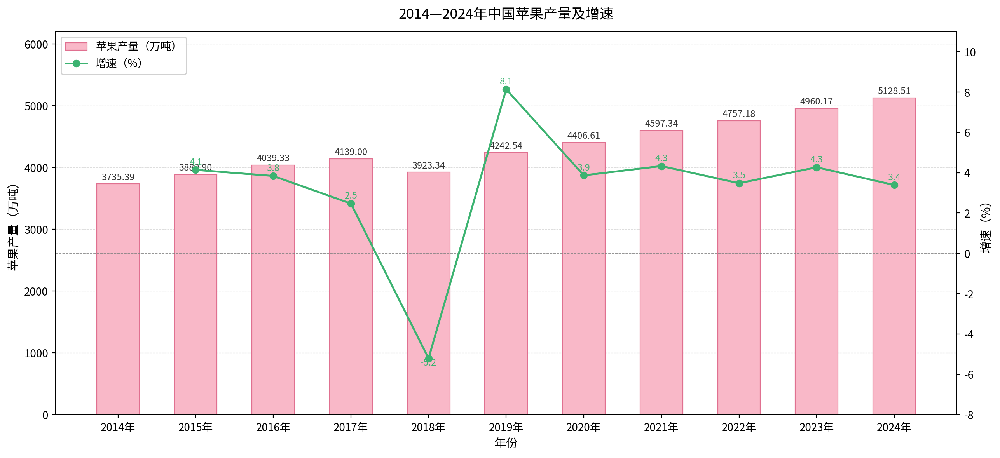
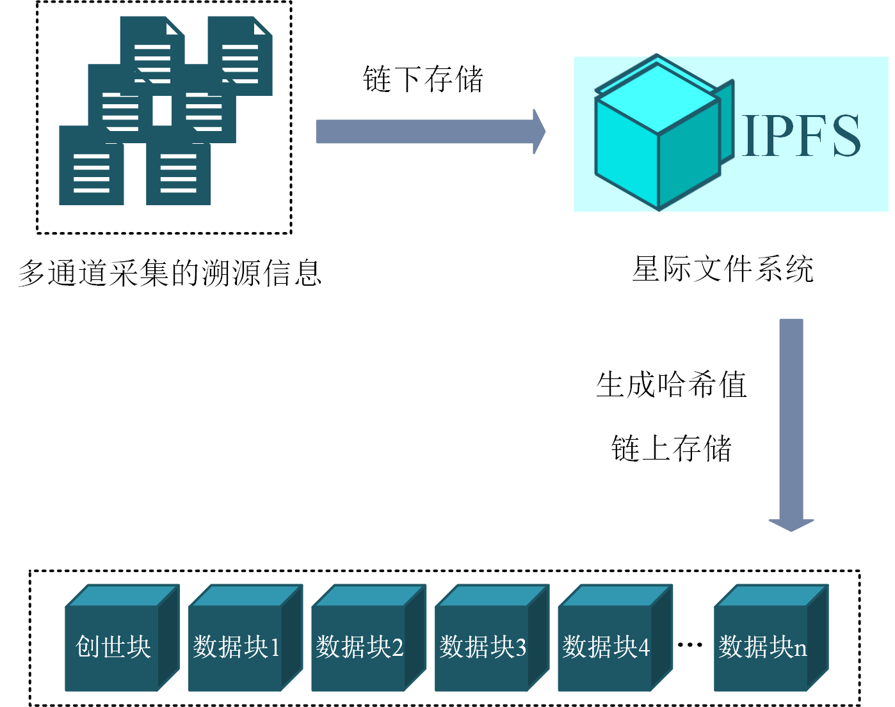
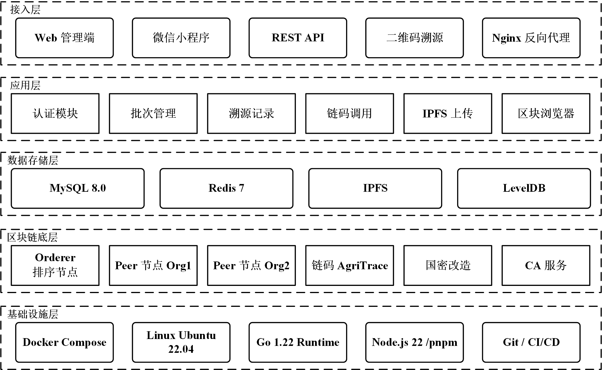
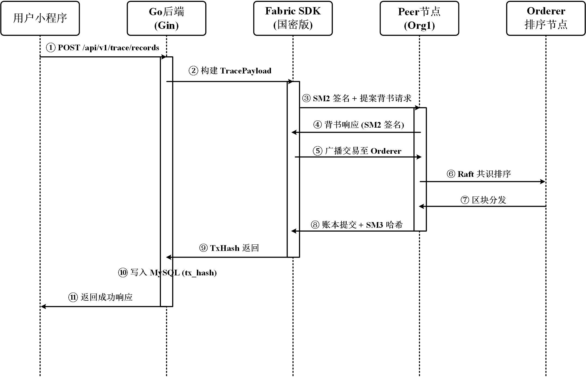
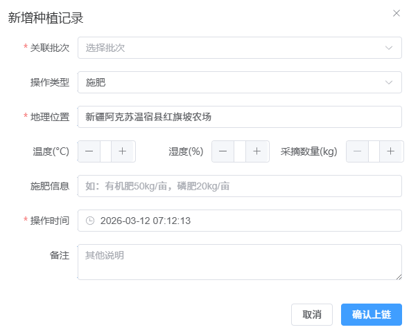
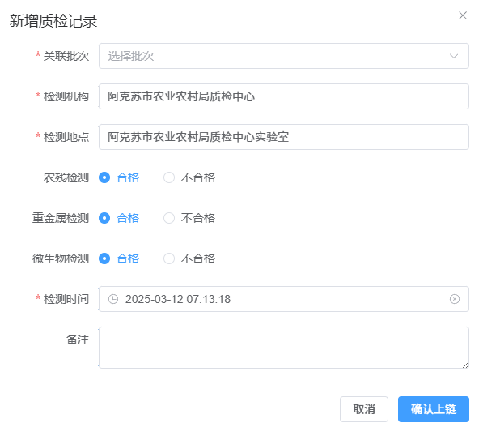
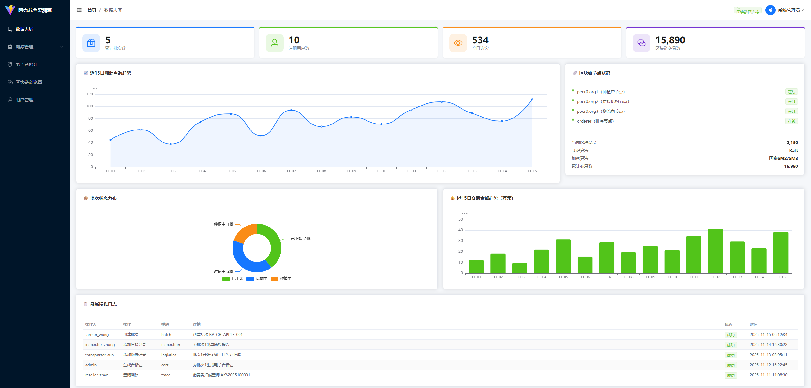
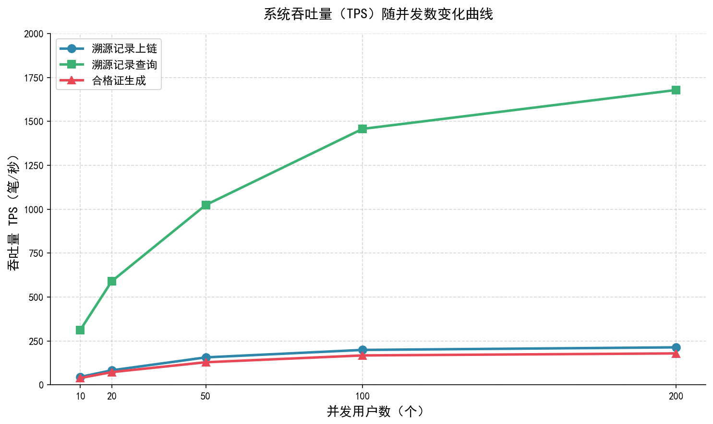
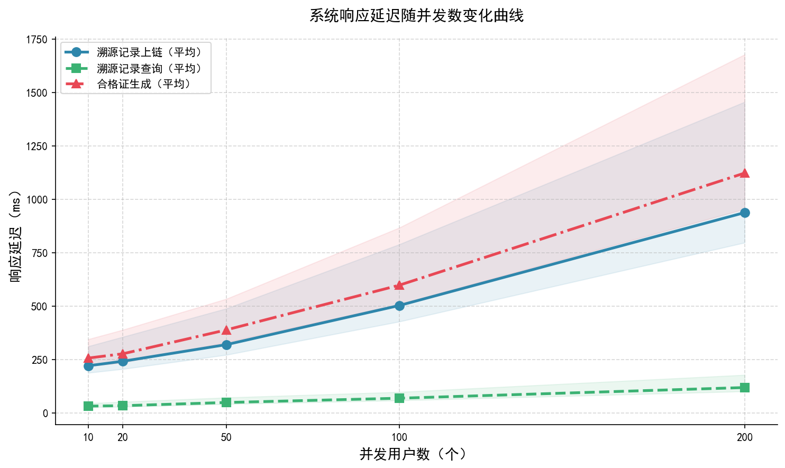

<!-- 首页 -->

  
    
  <h1 style="color: #2E7D32;">基于区块链技术的农产品溯源 关键技术研究</h1>
   
  <h3>硕士学位论文预答辩</h3>
   
  
<b>汇报人：</b>柏小康

  
<b>导&emsp;师：</b>张楠楠 教授

  
<b>专&emsp;业：</b>农业工程与信息技术

  
<b>日&emsp;期：</b>2026年3月

---

## 汇报提纲

1. <b>研究背景与意义</b> (Background & Significance) 
2. <b>研究内容与技术路线</b> (Research Content & Roadmap) 
3. <b>系统方案与架构设计</b> (System Architecture Design) 
4. <b>核心技术：国密算法嵌入</b> (Core Tech: GM Algorithm) 
5. <b>系统实现与测试评估</b> (Implementation & Testing) 
6. <b>结论与展望</b> (Conclusion & Future Work)

---

## 1. 研究背景与意义

**传统溯源面临的挑战：**
* 市场体量大但信任缺失（食品安全问题频发）。
* 传统溯源系统多为**中心化模式**，存在数据易篡改、形成“信息孤岛”、单点故障等弊端。

  

    
    
图：中国苹果产量保持高位

  

  

    
    
图：传统中心化溯源痛点

  

**区块链的引入：** 带来去中心化、不可篡改、公开透明的优势，是重塑农产品供应链信任的关键技术。

---

## 2. 研究内容与技术路线

为解决区块链在溯源中面临的**存储瓶颈**与**安全合规**挑战，本研究开展了如下工作：

  

1. 提出**双存储模型**（Fabric + IPFS）解决大文件存储压力。
2. 突破底层源码，将**国密算法**（SM2/SM3/SM4）深度嵌入Fabric平台。
3. 全栈开发实现**多端协同**的可信农产品溯源原型系统。

---

## 3.1 系统方案设计：全链路信息交互模型

覆盖农产品“从农场到餐桌”的完整供应链生命周期（种植 $\rightarrow$ 加工 $\rightarrow$ 仓储/物流 $\rightarrow$ 销售 $\rightarrow$ 消费者监管）。

  

---

## 3.2 架构设计：链上链下双存储模型

* **痛点：** 区块链直接存储图片/视频/质检报告（PDF）成本高、极易导致账本爆炸。
* **方案：** **Fabric（存证） + IPFS（原文件）**

  
  

  核心存证数据（时间戳、责任人、哈希）上链，大文件存储在IPFS并通过CID关联。
  

---

## 3.3 系统总体架构设计

采用分层解耦原则，划分为：数据采集层、存储层（Fabric+IPFS+MySQL）、网络层、合约层、应用服务层(Gin)及用户界面层(Vue+微信小程序)。

  

---

## 4.1 核心技术突破：国密算法(SM2/SM3/SM4)嵌入

为满足国内关键信息基础设施的合规性，改造了Fabric的 **BCCSP**（密码服务提供者）模块。

  

    
    
国密算法嵌入设计思路

  

  

    
    
BCCSP 接口实现

  

* **SM2：** 替换ECDSA进行身份认证与交易签名。
* **SM3：** 替代SHA256生成区块及数据摘要。
* **SM4：** 用于链下敏感业务数据的对称加密。

---

## 4.2 国密算法上链时序与性能评估

  

    
    
基于国密的核心交易背书上链时序

  

  

    
    
时间开销对比评估

  

**结论：** 国密算法在签名验签的时间开销上略有增加，但整体在可接受范围内，成功实现了合规性与安全性的跃升。

---

## 5.1 系统实现：底层环境与全栈开发

通过Docker容器化部署底层Fabric节点与IPFS服务。前端采用 Vue3 + Element Plus，C端采用微信小程序原生开发。

  
  
溯源系统底层区块链网络自动化脚本启动过程

---

## 5.2 系统实现：B端管理与录入展示

  

    
    
农事种植记录上链

  

  

    
    
质检报告(PDF存IPFS，哈希上链)

  

  

    
    
全链路宏观数据监管大屏

  

---

## 5.3 系统实现：C端溯源查询与底层校验

消费者只需微信扫码，即可重构从源头采摘到终端上架的绿皮书。

  

    
  

  

    
  

  

    
    
区块浏览器实时校验交易与哈希

  

---

## 5.4 系统测试：并发性能压测

  

    
  

  

    
  

* **性能指标：** 在读操作（溯源查询）下，借助Redis，峰值TPS超800+；在国密写操作上链下，TPS稳定在198左右。
* **结论：** 对于农业非高频交易场景（万级别日吞吐），完全满足企业级生产应用需求。

---

## 6. 研究成果总结

**研究成果：**
1. 构建了基于Hyperledger Fabric和IPFS的**双存储农产品溯源模型**。
2. 实现了**国密算法(SM2/SM3/SM4)**在Fabric底层架构的深度嵌入。
3. 全栈开发了一套具备**防伪查验和数据大屏**的多端溯源系统。

**期间学术成果产出：**

  
  

---

  
     
  <h1 style="color: #2E7D32;">恳请各位专家批评指正！</h1>
   
  <h3>Thanks for Listening</h3>

