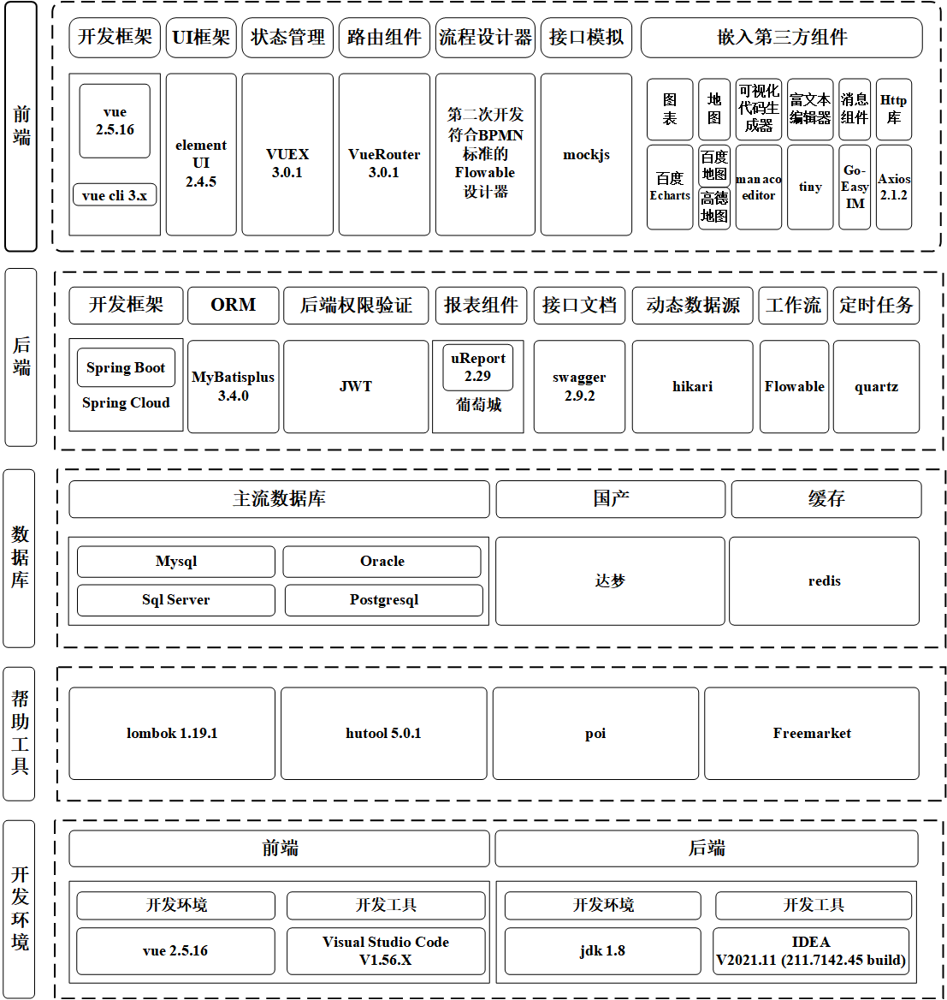

# 塔里木大学研究生学位论文开题报告

| 项目                        | 内容                                       |
| :-------------------------- | :----------------------------------------- |
| **课题名称**                | **基于区块链技术的农产品溯源关键技术研究** |
| **学生姓名**                | 柏小康                                     |
| **导师姓名**                | 张楠楠                                     |
| **学位类别**                | 农业硕士                                   |
| **专业（全日制/非全日制）** | 农业工程与信息技术（全日制）               |
| **所在学院**                | 信息工程学院                               |
| **入学时间**                | 2023年9月                                  |

 

**塔里木大学研究生处制**
**填表时间**：2024 年 11 月 1 日

---

> **填表说明**
>
> 一、 本表为研究生进入论文课题研究前的论证依据。
> 二、 研究生在导师指导下填写。
> 三、 本表填写一式3份，由学院、学科组及研究生保存，作为课题中期检查及论文答辩的依据，请妥善保存，切勿丢失。
> 四、 请用A3骑马装订。

---

## 一、立论依据

**（包括课题的研究意义，国内外研究现状分析，附主要的参考文献）**

### 1.1 研究背景

随着社会经济的快速发展和人们生活水平的提高，食品安全问题日益受到关注。农产品作为食品的重要组成部分，其质量和安全直接影响到消费者的健康和生命安全[1]。然而，接连不断的食品安全问题，如“瘦肉精”猪肉事件[2]、老坛酸菜面的酸菜“土坑工艺、足踩发酵”事件等，使得大众对市场上的食用农产品的信任度有所降低。如何提高食用农产品的安全生产和加强质量管理，落实社会监管途径，实现农产品的可信可追溯越来越引起了学术界和商业界的关注[3]。

传统的农产品溯源系统基于中心化数据库，将信息数据储存到中心数据库中，并通过访问数据库的方式进行信息溯源。这种方式可能存在信息不透明、数据易篡改、信任度低等问题[4]，难以满足现代农业生产和消费者需求。农产品的供应链非常复杂，这使得农产品安全监管和溯源在实际操作中面临极大的挑战。供应链中包含多种参与者，如农民、加工厂、零售商和运输商等，同时农产品供应链中还包含大量数据。

区块链技术以其去中心化、不可篡改和透明性等特点，为农产品溯源提供了新的解决方案。自2008年中本聪提出比特币电子交易系统以来[5]，区块链技术在数字货币、溯源管理、电子政务等领域得到了广泛的发展和应用。区块链作为一种典型的分布式系统[6]，凭借其数据不可篡改、可追溯和去中心化等特点[7]，迅速成为信息技术领域的热点。区块链技术作为一种分布式账本技术，以其去中心化、不可篡改和透明性的特点[8]，为农产品溯源提供了新的视角，越来越多的人开始仔细审视这门新应用技术。区块链技术的应用可以确保溯源数据的真实性和不可篡改性，从而提高消费者对农产品的信任度。2019年，在中共中央进行第十八次集体学习上，习总书记提出区块链技术与传统行业领域相结合的观点，需要将区块链技术作为核心技术，推动“区块链+”的建设。将区块链技术与传统的农产品溯源模型结合，使得区块链的数据去中心化、账本不可篡改、数据高度安全的特性与溯源系统的本质需求相结合。区块链还集成了多种技术，如点对点(Peer-to-Peer, P2P)网络、共识机制、加密技术、智能合约等[9]。利用区块链技术对农产品进行追踪，可以解决现有追踪系统中存在的问题。

区块链主要分为三类：公有链、联盟链和私有链[10]。联盟链是指多个组织共同参与和管理的区块链。在隐私方面，联盟链介于公有链和私有链之间，数据只能由联盟的成员访问，联盟链的交易效率也高于公有链[11]。在溯源系统中，农产品供应链的主责方与供应链参与者之间存在合作关系。因此，本文选择联盟链作为基础网络。每个国家都有自己的国家加密算法，因此，在实施联盟链方案时支持国密算法尤其重要。Hyperledger Fabric是具有国际影响力的企业级区块链平台，其默认密码算法为国际标准密码算法，缺乏对国密算法的支持[12]，但是对世界各国企业而言，区块链项目存在根据行业规范或当地法律法规调整加密算法或实施细节的需要。另外，Fabric的密码套件虽然是可插拔式的，但是密码算法扩展性上还是存在一些限制。

区块链技术可以确保可追溯数据的安全存储和信息源的追踪，使农产品具有可信赖和可追溯性，但直接在区块链上处理和存储农产品可追溯信息仍然面临着新的挑战。例如：

1.  **数据存储和管理**：农产品流转过程中产生的大量图片、视频及环境传感数据，直接上链会导致区块膨胀，降低系统吞吐量。传统的中心化数据库存在单点故障和数据篡改的风险，而区块链技术可以实现数据的去中心化存储和管理。
2.  **数据隐私和安全**：目前主流开源区块链平台默认采用国际标准加密算法，无法满足我国对关键信息基础设施使用国产密码算法的安全自主可控要求。农产品溯源数据涉及到生产者、供应商和消费者的隐私信息，需要采用加密算法确保数据的安全性和隐私保护。
3.  **系统性能和扩展性**：区块链技术在实际应用中面临性能和扩展性的挑战，需要通过优化算法和架构设计来提高系统性能和扩展性。

本研究旨在通过区块链技术提升农产品溯源系统的可信度和效率，为保障食品安全、促进农业现代化提供技术支持。研究重点是如何将区块链与农产品追溯更好地融合，以确保农产品数据的安全性、可追溯性、不变性和可达性。

### 1.2 研究意义

农产品溯源机制的实施显著提高了农产品来源和流通路径的追踪效率，有效识别了食品安全隐患，确保了产品的健康质量。同时，该机制通过验证产品真实性和支持价格合理性，降低了欺诈风险。然而，面对众多电子商务平台及其单一管理模式，农产品质量参差不齐，质量检测难以全面实施。为此，我国农业部门致力于构建有效的追溯系统，以解决线上交易中的质量问题。值得注意的是，传统溯源系统大多都是中心化的平台[13]，其信息集中管理虽便于操作，但数据安全和监管手段的不足，易导致数据篡改和安全风险。

本文通过对溯源方案进行设计，采用区块链技术，并进行Web应用程序开发，构建了一个基于区块链的农产品溯源信息系统。该系统通过分布式账本和智能合约技术，实现农产品全流程可信记录与不可篡改存证，对加强农产品全过程管理、促进食品安全具有重要的现实意义。

围绕基于区块链技术的农产品溯源关键技术研究，本文的研究意义在于：通过区块链技术提升农产品溯源系统的可信度和效率，保障食品安全，增强消费者信任，促进农业生产的数字化转型，提升农业生产效率和管理水平，并为其他领域的应用提供有益的参考和借鉴。

### 1.3 国内外发展现状

#### 1.3.1 传统农产品溯源研究现状
农产品溯源技术利用现代信息技术对农产品进行追溯，记录和追溯其从种植到餐桌的全过程，对于保障食品安全和提高消费者信任度具有重要意义。

2011年，我国发布了《食品工业“十二五”发展规划》，该规划提出在“十二五”阶段将对食品信息追溯体系进行加快建设，对食品的生产企业进行强化提高，保证产业的信息化服务建设，并优先对果蔬与肉类等实用农产品进行信息溯源。2019年，我国发布《2019年全国标准化工作要点》，提出对食品信息溯源标准进行制定并试运行，旨在提高国家食品质量安全，通过建立优质食品体系，建立食品行业可持续发展的基本国家标准。

在国家政策方面，自1995年起，中国正式实施了《食品卫生法》[14]，规定流通中的食品包装上应添加食品标签及其他规定信息。2001年，中国开始引入质量和食品安全溯源系统。上海发布了《上海市食用农产品安全监管暂行办法》[15]，引入食品流通溯源系统以应对食品安全问题。2003年，中国采纳了《食品生产加工企业质量安全监督管理办法》，规定所有流通和销售的食品必须经过检验，符合食品质量标准，并附有食品销售市场的可流通标志。

2011年，中国发布了《食品工业发展“十二五”规划》，提出在“十二五”期间将加快食品信息溯源系统的建设，加强和改进食品生产企业，确保工业信息服务的建设，并优先推进水果、蔬菜和肉类等实用农产品的信息溯源。2019年，中国发布了《2019年国家标准化工作要点》，提出制定和试运行食品信息溯源标准，旨在提高国家食品质量和安全，通过建立高质量食品体系，制定食品工业可持续发展的基本国家标准。2020年，中国发布了《第十四个五年规划和2035年远景目标》，提出强化全过程农产品质量安全监管和健全追溯体系的要求，推动农业农村现代化。

传统的农产品溯源系统主要依赖于中心化的数据库和信息管理系统，管理方法明确且高效，但传统溯源模型中心化程度高[16][17]，存在数据易篡改、信息不透明等问题。尽管一些先进的技术如条形码、二维码和RFID等已经在农产品溯源中得到应用，但仍然难以解决信息不对称和数据安全问题。

#### 1.3.2 基于区块链的农产品溯源研究现状
近年来，区块链技术在农产品溯源中的应用研究逐渐增多，国内外许多研究机构和企业已经开始探索和实践基于区块链的农产品溯源系统，区块链可能是目前在供应链网络中提供可追溯性相关服务的最有前途的技术之一。在文献中存在许多关于区块链支持的供应链可追溯性的综述论文。

文献[18]提出了一个基于区块链和边缘计算的有机食品供应信息管理框架，实现了一个基于区块链的数据共享模型，以确保可追溯性记录的不变性。边缘计算用于降低数据处理成本，提高平均响应时间。文献[19]提出将物联网、机器学习和区块链技术用于农药产品的反向链。文献[20]提出了一个基于联盟区块链和智能合同的跟踪和追踪农产品的框架。农民使用IPFS（Inter Planetary File System）记录环境细节和作物生长数据，然后在智能合约中存储IPFS散列，提高数据安全性，缓解区块链存储爆炸问题。文献[21]中描述了一种链上和链外可追溯性信息的双存储结构，以减轻链负载应变，实现有效的信息查询。该系统提高了查询效率和数据安全性，保证了数据管理的有效性和可靠性，满足了实际的应用需求。文献[22]提出了一个分散的NFC支持的反假冒系统，以促进葡萄酒行业中可靠的数据来源的检索、验证和管理。

文献[23]提出了一种基于以太坊平台的食品溯源系统，采用双存储模型，将数据存储在本地数据库和区块链的哈希值中，以提高区块链的效率并解决其可扩展性问题。文献[24]展示了一种结合区块链和二维码的框架，实现食品信息的数字化和便捷溯源，该框架部署在云端，具有存储和可扩展性优势，但在面对大规模生产时可能增加成本。文献[25]整合了区块链、云计算、二维码和强化学习技术，开发了一种有效减少食品浪费的框架。文献[26]提出了一种基于国密算法的区块链交易数据隐私保护方案，实现了对Hyperledger Fabric平台的国密改造，并确保了执行效率和系统性能满足实际需求。文献[27]提出了一种结合国密算法的混合算法，用于互联网访问用户身份认证，实现了教育区块链身份认证框架的高效安全认证。

但是，上述研究在区块链农产品溯源领域虽已取得进展，但在存储容量、可伸缩性以及企业敏感数据保护方面仍存在局限性。文献[28]提出了基于国密SM2批量验签的区块链系统，通过优化交易确认模型以提高系统吞吐率和灵活性，最后对所提出的可跟踪性系统进行了实施和测试，并进行了详细的分析。

#### 1.3.3 国内外研究现状总结
本文通过大量文献综述，分析和探索，区块链技术在农产品溯源中的应用研究已经取得了一定的进展，但仍然存在一些问题和挑战。传统的农产品溯源系统主要依赖于中心化的数据库和信息管理系统，尽管管理方法明确且高效，但存在数据易篡改、信息不透明等问题。

近年来，区块链技术以其去中心化、不可篡改和透明性等特点，为农产品溯源提供了新的解决方案。国内外许多研究机构和企业已经开始探索和实践基于区块链的农产品溯源系统，如基于区块链和边缘计算的有机食品供应信息管理框架、物联网和机器学习结合区块链技术的应用、联盟区块链和智能合同的农产品跟踪和追踪框架等。此外，部分学者提出了基于国密算法的区块链交易数据隐私保护方案和混合算法的用户身份认证。

然而，现有区块链溯源系统仍存在性能和扩展性问题、数据隐私保护问题等，需要进一步研究和解决。因此，本文将围绕基于区块链技术的农产品溯源关键技术研究，探讨如何提升农产品溯源系统的可信度和效率，保障食品安全，增强消费者信任。

**参考文献：**
[1] 霍红, 钟海岩. 农产品供应链质量安全中区块链技术投入的演化分析[J]. 运筹与管理, 2023, 32(01): 15-21.
[2] 王新庄. 食品安全问题探讨及法律规制研究——评《食品安全法原理》[J]. 食品安全质量检测学报, 2022, 13(17): 5769.
[3] 陆秋俊. 基于物联网技术构建现代农业种植及食品溯源系统[J]. 现代农业科技, 2019(22): 252-253.
[4] Lu Y, Li P, Xu H. A Food anti-counterfeiting traceability system based on Blockchain and Internet of Things[J]. Procedia Computer Science, 2022, 199: 629-636.
[5] Nakamoto S. Bitcoin: A peer-to-peer electronic cash system[EB/OL]. (2008-10-321) [2024-11-07]. https://nakamotoinstitute.org/library/bitcoin/.
[6] Si B R, Xiao J, Liu C Y, et al. Survey on blockchain network[J]. Journal of Software, 2024, 35(2): 773-799.
[7] Hai J, Jiang X. Towards trustworthy blockchain systems in the era of “Internet of value”: development, challenges, and future trends[J]. Science China Information Sciences, 2021, 65(5): 153101.
[8] 倪雪莉, 马卓, 王群. 区块链P2P网络及安全研究[J]. 计算机工程与应用, 2024, 60(5): 17-29
[9] Tabatabaei M H, Vitenberg R, Veeraragavan N R. Understanding blockchain: Definitions, architecture, design, and system comparison[J]. Computer Science Review, 2023, 50: 100575.
[10] 司冰茹, 肖江, 刘存扬, 等. 区块链网络综述[J]. 软件学报, 2024, 35(02): 773-799.
[11] Liu S, Zhang R, Liu C, et al. P-PBFT: An improved blockchain algorithm to support large scale pharmaceutical traceability[J]. Computers in Biology and Medicine, 2023, 154: 106590.
[12] 曹琪, 阮树骅, 陈兴蜀, 等. Hyperledger Fabric平台的国密算法嵌入研究[J]. 网络与信息安全学报, 2021, 7(01): 65-75.
[13] 江巧玲. 东源县农产品质量安全监管问题研究[D]. 广州: 仲恺农业工程学院, 2020.
[14] 朱祉琴. 浅谈食品卫生法与安全现状分析[J]. 食品安全导刊, 2020(18): 38-39.
[15] 赵阳, 孟慧敏. 我国重要产品追溯体系建设实践和对策建议[J]. 轻工标准与质量, 2024(05): 131-134.
[16] 柳祺祺, 夏春萍. 基于区块链技术的农产品质量溯源系统构建[J]. 高技术通讯, 2019, 29(03): 240-248.
[17] 雷志军. 基于区块链的农产品溯源信息系统研究[D]. 赣州: 江西理工大学, 2022.
[18] Hu S, Huang S, Huang J, et al. Blockchain and edge computing technology enabling organic agricultural supply chain: A framework solution to trust crisis[J]. Computers & Industrial Engineering, 2021, 153: 107079.
[19] Monteiro E S, Da Rosa Righi R, Barbosa J L V, et al. APTM: A model for pervasive traceability of agrochemicals[J]. Applied Sciences, 2021, 11(17): 8149.
[20] Wang L, Xu L, Zheng Z, et al. Smart contract-based agricultural food supply chain traceability[J]. IEEE Access, 2021, 9: 9296-9307.
[21] Yang X, Li M, Yu H, et al. A trusted blockchain-based traceability system for fruit and vegetable agricultural products[J]. IEEE Access, 2021, 9: 36282-36293.
[22] Yiu N C K. Decentralizing supply chain anti-counterfeiting and traceability systems using blockchain technology[J]. Future Internet, 2021, 13(4): 84.
[23] Fei C, Chunming Y, Tao C. Design of food traceability system based on blockchain[J]. Computer Engineering and Applications, 2021, 57(02): 60-69.
[24] Dey S, Saha S, Singh A K, et al. FoodSQRBlock: Digitizing food production and the supply chain with blockchain and QR code in the cloud[J]. Sustainability, 2021, 13(6): 3486.
[25] Dey S, Saha S, Singh A K, et al. SmartNoshWaste: Using blockchain, machine learning, cloud computing and QR code to reduce food waste in decentralized web 3.0 enabled smart cities[J]. Smart Cities, 2022, 5(1): 162-176.
[26] 王晶宇, 马兆丰, 徐单恒, 等. 支持国密算法的区块链交易数据隐私保护方案[J]. 信息网络安全, 2023, 23(03): 84-95.
[27] 王家峰. 基于混合算法的互联网访问用户身份认证方法[J]. 齐齐哈尔大学学报(自然科学版), 2024, 40(03): 5-10.
[28] 刘丁宁. 基于国密SM2批量验签的区块链系统的研究与应用[D]. 北京: 北京邮电大学, 2022.

---

## 二、研究方案

**（包括研究目标、研究内容、拟采取的研究方法、技术路线、实验方案及可行性分析及必须采取的措施(准备工作、现有条件、可能遇到的困难和问题与解决途径)**

### 2.1 研究目标

1.  **构建一个基于区块链技术的农产品溯源平台**，通过区块链技术确保农产品数据的安全性、可追溯性、不变性和可达性。解决现有区块链溯源系统中存在的性能和扩展性、数据隐私保护等问题。
2.  **保障食品安全**，通过农产品追溯，迅速确定农产品的生产来源和分销渠道，帮助识别和解决食品安全问题。
3.  **实现农产品从生产到消费全过程的信息可追溯和可共享**，保障食品安全，增强消费者信任。
4.  **促进农业现代化**，通过数字化转型，提升农业生产效率和管理水平。

### 2.2 研究内容和技术路线

#### 2.2.1 研究内容
针对当前农产品溯源平台存在的问题，本文基于Hyperledger Fabric联盟链框架、星际文件系统(IPFS)以及相关加密技术，研究并设计实现了一个基于区块链的农产品溯源平台。本文通过大量文献综述，分析和探索现有的农产品溯源技术、解决方案和区块链加密算法，发现现有区块链溯源系统存在的不足和问题，例如溯源码易被复制伪造、区块链存储瓶颈和加密算法待优化等问题。针对这些问题设计对应解决方案，具体做了如下工作：

1.  **设计基于区块链的农产品溯源方案**：研究区块链技术在农产品溯源中的应用原理和技术路线；设计基于区块链的农产品溯源方案，确定系统架构和技术框架；结合传统的农产品溯源体系，设计满足市场需求和用户需要的溯源方案。这一步骤旨在通过区块链技术的去中心化、不可篡改和透明性特点，解决传统溯源系统中存在的信息不透明、数据易篡改等问题。
2.  **构建区块链+IPFS农产品溯源信息模型**：研究IPFS的分布式存储技术，解决区块链存储容量有限的问题；构建区块链+IPFS农产品溯源信息模型，实现数据的去中心化存储和管理；设计溯源数据存储解决方案，IPFS作为辅助用于存储大文件，区块链存储数据摘要信息。这一步骤通过引入IPFS，解决了区块链存储容量有限的问题，确保了数据的去中心化存储和管理。
3.  **Fabric平台国密算法嵌入设计思路**：基于同济开源国密实现源码，为Fabric平台BCCSP添加SM2、SM3和SM4算法模块与接口；提出基于国密算法与区块链技术的数据记录、存储解决方案。这一步骤通过嵌入国密算法，提高了数据的安全性和隐私保护，确保了数据的完整性和不可篡改性。
4.  **设计基于区块链的农产品信息溯源系统**：搭建区块链网络相关环境和底层平台，开发Web应用程序，实现系统的完整功能；分析系统需求、系统功能，进行概要设计，使用超级账本框架实现农产品溯源系统；对系统性能进行测试，确保其实用性，实现从“农场到餐桌”的信息可追溯和可共享。这一步骤通过实际系统的搭建和测试，验证了前述设计方案的可行性和有效性，确保了系统的实用性和可靠性。

根据本模型的设计，编码实现了基于区块链的农产品溯源信息管理系统，并对系统进行功能测试以及验证是否达到预期结果。设计面向农产品区块链溯源系统，采用“区块链+数据库”的双存储模式，缓解区块链存储压力，避免传统数据库的集中化管理及数据易改的风险。结合实际农产品溯源应用场景设计农业溯源系统各功能模块，并对系统功能和性能进行实现与测试。

#### 2.2.2 技术路线
首先通过查询相关文献，了解传统农产品溯源和基于区块链的农产品溯源技术，研究相关理论技术，包括区块链技术、国密算法和供应链管理技术。接着进行实地调研与实例分析，分析传统溯源和区块链溯源存在的问题，并提出改进的区块链溯源方案。然后，设计基于区块链的溯源方案及模型，包括溯源流程分析、智能合约设计和数据存储设计。此外，嵌入国密算法，提高系统的安全性和隐私保护。最后，采用Hyperledger Fabric联盟链框架和IPFS分布式存储技术，开发Web应用程序，实现基于区块链的农产品溯源系统，并进行系统需求分析、测试和功能实现。

本文技术路线如下图1所示。

图1 技术路线图

### 2.5 实验方案及可行性分析及必须采取的措施

#### 2.5.1 实验方案
本研究主要围绕基于区块链技术的农产品溯源系统展开，包括溯源方案设计、IPFS溯源信息模型构建、国密算法嵌入和溯源系统设计等内容。

首先，设计基于区块链的农产品溯源方案，研究区块链技术在农产品溯源中的应用原理，确定系统架构和技术框架。接着，构建区块链+IPFS农产品溯源信息模型，研究IPFS的分布式存储技术，设计溯源数据存储解决方案。然后，在Fabric平台中嵌入国密算法，为Fabric平台BCCSP添加SM2、SM3和SM4算法模块与接口，提出数据记录、存储解决方案，国密算法嵌入设计思路如图2所示。

图2 Fabric平台国密算法嵌入设计思路

在实验方案中, 本研究将严格遵循国家标准 GB/T 29373-2012《农产品追溯要求 果蔬》来定义智能合约中的数据结构与采集规范。该标准明确了果蔬类农产品在生产、加工、物流、销售各环节的追溯信息项。需要考虑农产品供应链溯源流程图如图3所示，该流程图涵盖了从农民种植到消费者购买的各个环节，包括运输信息、种植信息、收储信息、加工信息、销售信息和消费信息。每个环节的信息通过智能合约和物流信息流进行记录和传递，确保数据的透明性和不可篡改性。

图3 农产品供应链溯源流程图

最后，搭建基于Hyperledger Fabric的区块链网络环境，使用hyperleger fabric实现的业务网络如图4所示，设计并实现基于区块链的农产品溯源信息模型，开发Web应用程序，实现农产品溯源系统的各项功能，并对系统进行功能测试和性能测试，验证其实用性和可靠性。通过这些步骤，确保农产品溯源系统的安全性、可靠性和高效性。

图4 使用hyperleger fabric实现的业务网络

#### 2.5.2 可行性分析
通过对区块链技术和农产品溯源需求的分析，确定研究方案的可行性。首先，区块链技术在溯源领域已有成功应用案例，具备可行性。其次，Hyperledger Fabric联盟链框架成熟，适合企业级应用。此外，IPFS分布式存储技术能够解决区块链存储瓶颈问题。最后，国密算法的嵌入能够提高数据安全性，符合国家政策要求。

在技术可行性方面，区块链技术和IPFS分布式存储技术已经在多个领域得到应用，具有较高的技术成熟度。在经济可行性方面，通过数字化转型，可以提高农业生产效率，降低管理成本，具有较高的经济效益。在社会可行性方面，提升农产品溯源系统的可信度和效率，保障食品安全，增强消费者信任，具有重要的社会意义。

综上所述，本研究方案在技术、经济和社会三个方面均具有较高的可行性，确保研究目标的实现。

#### 2.5.3 准备工作及现有条件
在进行基于区块链技术的农产品溯源系统研究之前，需要进行充分的准备工作，确保研究目标的顺利实现。首先，在技术准备方面，需要熟悉区块链技术及其在农产品溯源领域的应用，学习IPFS分布式存储技术，获取国密算法的相关资料和源码，确保数据的安全性和隐私保护，同时，深入研读并拆解 GB/T 29373-2012《农产品追溯要求 果蔬》标准，根据标准要求设计系统数据库表结构与上链数据字段，确保系统的业务流程符合国家规范。其次，在资源准备方面，需要具备必要的硬件设备，如服务器、网络环境等，以及软件工具，如区块链开发平台、IPFS节点等。开发工具表如表1所示。

**表1 开发工具表**

| 模块             | 工具                       |
| :--------------- | :------------------------- |
| **操作系统**     | Ubuntu 20.04 LTS           |
| **区块链平台**   | Hyperledger Fabric V2.2.15 |
| **智能合约语言** | Go 1.23.1                  |
| **其他工具**     | Docker、Caliper等          |

技术架构方面，采用Hyperledger Fabric V2.2作为区块链框架，结合IPFS分布式存储技术，利用力软JAVA快速开发平台和运维开发一体化平台进行软件开发，力软JAVA快速开发平台技术栈如图5所示。现有条件方面，可以利用已有的区块链技术研究成果和开源项目，结合农产品溯源领域的相关研究和应用经验，确保研究方案的可行性和实用性。

图5 力软JAVA快速开发平台技术栈

#### 2.5.4 可能遇到的困难和问题与解决途径
1.  **区块链技术的性能和扩展性问题**：区块链技术在实际应用中面临性能和扩展性的挑战，通过优化区块链网络结构和算法，提高系统性能和扩展性。
2.  **数据隐私保护问题**：农产品溯源数据涉及到生产者、供应商和消费者的隐私信息，通过嵌入国密算法，确保数据的安全性和隐私保护。
3.  **系统集成和测试问题**：通过详细的系统设计和测试计划，确保系统的稳定性和可靠性。

---

## 三、预期达到的目标和主要创新点

### 3.1 本研究的预期目标
1.  **建立全面的溯源信息模型**：预期的目标之一是构建一个结合区块链和IPFS技术的农产品溯源信息模型，确保从农田到餐桌的每一步信息都被记录和共享。通过这种方式，实现农产品全生命周期的信息透明化，为消费者和监管机构提供详尽的可追溯信息。
2.  **确保数据安全与去中心化存储**：通过在Fabric平台上集成国密算法，目标是将数据安全性提升到最高标准，并利用IPFS实现数据的去中心化存储。这不仅提高了数据的安全性，还增强了系统的抗篡改能力，从而提升整个溯源系统的可信度。
3.  **提升系统效率与可信度**：设计的系统旨在通过优化区块链网络结构和数据处理流程，提高农产品溯源系统的运行效率。同时，通过确保数据的不可篡改性，进一步增加系统的可信度，使消费者和供应链参与者更加信赖溯源信息。
4.  **保障食品安全与响应速度**：预期的效果包括能够迅速通过溯源系统定位食品安全问题，及时采取措施，减少食品安全事件的影响。这有助于保护消费者健康，同时提升农产品品牌形象。
5.  **推动农业现代化与消费者信任**：最终目标是通过区块链技术的应用，推动农业产业的数字化转型，提高农业生产效率和管理水平。同时，提供透明、可靠的农产品信息，增强消费者对农产品的信任，促进农业市场的健康发展。

### 3.2 主要创新点
1.  **区块链与农产品溯源的结合**：区块链技术的去中心化、不可篡改和透明性特点使其成为农产品溯源系统的理想选择。通过将农产品从生产、加工、运输到销售的全过程数据记录在区块链上，可以确保数据的真实性和可追溯性。这不仅提高了消费者对农产品的信任度，还有助于企业在出现问题时快速定位和解决问题。
2.  **引入星际文件系统（IPFS）**：为了解决区块链系统存储资源浪费的问题，本文提出了“链上索引，链下存储”的方式。具体来说，将区块链数据索引存入Hyperledger Fabric账本数据库，而将链上数据主体存入到星际文件系统（IPFS）中。这种方式不仅减轻了区块链系统的存储压力，还确保了数据的安全性和可访问性。
3.  **在Fabric平台上嵌入国密算法**：为了提高数据的安全性和隐私保护，本文在Hyperledger Fabric平台中嵌入了SM2、SM3和SM4算法。这些国密算法在数据加密、数字签名和哈希函数方面具有较高的安全性，能够有效防止数据被篡改和泄露。

---

## 四、研究进度及时间安排

| 序号 |  开始日期  |  结束日期  | 主要工作内容（研究开发进度）       |
| :--: | :--------: | :--------: | :--------------------------------- |
|  1   | 2024年11月 | 2024年2月  | 研究背景调查和文献综述             |
|  2   | 2025年3月  | 2025年4月  | 设计基于区块链的农产品溯源方案     |
|  3   | 2025年5月  | 2025年6月  | 构建区块链+IPFS农产品溯源信息模型  |
|  4   | 2025年7月  | 2025年8月  | Fabric平台国密算法嵌入设计         |
|  5   | 2025年9月  | 2025年10月 | 设计基于区块链的农产品信息溯源系统 |
|  6   | 2025年11月 | 2026年3月  | 整理研究数据，撰写、修改论文       |
|  7   | 2026年4月  | 2026年6月  | 参加论文答辩                       |

---

## 五、经费预算

| 支出科目                              | 金额（万元） | 计算根据及理由                             |
| :------------------------------------ | :----------: | :----------------------------------------- |
| **出版/文献/信息传播/知识产权事务费** |     0.3      | 发表论文、申请软著；文献、检索、期刊订购等 |
| **实验材料费**                        |     0.2      | 自封袋、牛皮信封等实验耗材                 |
| **差旅费**                            |     0.3      | 赴各实验基地采集数据                       |
| **仪器设备费**                        |     0.2      | 服务器租赁、软件购买等费用                 |

> 注：预算支出科目按下列顺序填写：1、论文课题业务费 2、实验材料费 3、仪器设备费