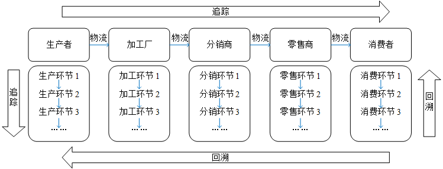
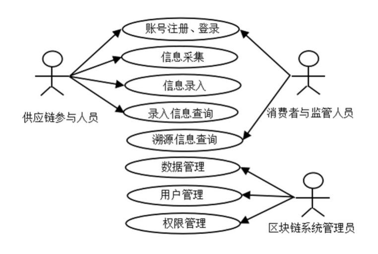

***

# 硕士学位论文

<br>

|                 |                        |
| :-------------- | :--------------------- |
| **分类号：**    | **单位代码：** 10757   |
| **密级：** 公开 | **学号：** 10757232282 |

<br>
<br>

<center><h1>基于区块链的农产品溯源关键技术研究</h1></center>
<center><h3>Blockchain-based Key Technology Research on Agricultural Product Traceability</h3></center>

<br>
<br>

|                         |                    |
| :---------------------- | :----------------- |
| **研 究 生 姓 名：**    | 柏小康             |
| **指 导 教 师：**       | 张楠楠 教授        |
| **合 作 指 导 教 师：** |                    |
| **申请学位门类级别：**  | 农学硕士           |
| **专 业 名 称：**       | 农业工程与信息技术 |
| **研 究 方 向：**       | 农业信息化         |
| **所 在 学 院：**       | 信息工程学院       |

<br>
<br>
<br>

<center><strong>TARIM UNIVERSITY</strong></center>
<center><strong>新疆·阿拉尔</strong></center>
<center><strong>二〇二六年六月</strong></center>

---

<center>
**Blockchain-based Key Technology Research on Agricultural Product Traceability**

A Dissertation Submitted to
**Tarim University**

In Partial Fulfillment of the Requirements for the Degree of
**Master of Agriculture**

By
**Bai Xiaokang**
(Agricultural Engineering and Information Technology)

Dissertation Supervisor: **Prof. Zhang Nannan**

**June, 2026**
</center>

---

**塔里木大学研究生学位论文**

*   **送 审 编 号：** TD
*   **学位授予类别：** 专业学位硕士
*   **论 文 题 目：** 基于区块链技术的农产品溯源关键技术研究
*   **一级学科名称：** 农业
*   **一级学科代码：** 0951
*   **二级学科名称：** 农业工程与信息技术
*   **二级学科代码：** 095136
*   **论文研究方向：** 农业信息化

---

# 摘 要

近年来，农产品安全问题频发，严重影响了消费者信心与产业健康发展。传统农产品溯源系统多基于中心化数据库，存在数据不透明、易篡改、信任缺失等弊端。区块链技术融合了去中心化的结构、不可篡改的数据记录以及公开透明的流程，这些特性共同为构建可信赖的农产品溯源体系指明了新的解决方向。然而，区块链在实际溯源应用中仍面临存储容量有限、性能瓶颈以及特定安全合规（如国密算法支持）等关键技术挑战。

本文旨在研究并解决基于区块链的农产品溯源系统中的关键技术问题，设计并实现一个安全、高效、可扩展的农产品溯源解决方案。本文首先分析了农产品供应链特点，明确了各参与方角色与数据需求，在此基础上设计了基于联盟链（Hyperledger Fabric）的农产品溯源方案与覆盖“从农场到餐桌”全流程的信息交互模型。针对区块链存储瓶颈问题，本文构建了“区块链+IPFS”双存储数据管理模式，将溯源数据摘要和索引存储在链上，而原始大文件或敏感度较低数据则存入星际文件系统（IPFS），以确保数据的完整性、不可篡改性与存储效率。为满足国内特定安全合规需求，本文深入研究了Hyperledger Fabric平台的密码服务提供者（BCCSP）模块，并基于开源实现完成了国密算法（SM2/SM3/SM4）的适配与集成，增强了系统的密码安全性和合规性，并通过实验验证了其正确性与有效性。最后，以阿克苏苹果为例，开发并测试了基于国密Fabric的农产品溯源系统原型，搭建了包含国密支持和优化共识机制的溯源系统，实现了信息录入、查询、监管等核心功能，验证了整体方案的可行性和实用性。

研究结果表明，本文提出的关键技术解决方案能够有效提升农产品溯源系统的安全性、可信度和运行效率，为解决农产品安全问题、增强消费者信任、推动农业现代化提供了有价值的技术支撑和实践参考。

**关键词：** 区块链；农产品溯源；Hyperledger Fabric；IPFS；国密算法

---

# Abstract

In recent years, the frequent occurrence of agricultural product safety issues has severely affected consumer confidence and the healthy development of the industry. Traditional agricultural product traceability systems are mostly based on centralized databases, which have drawbacks such as data opacity, susceptibility to tampering, and lack of trust. Blockchain technology integrates a decentralized structure, immutable data records, and a publicly transparent process. These characteristics collectively point to a new solution for building a trustworthy agricultural product traceability system. However, blockchain still faces key technical challenges in practical traceability applications, such as limited storage capacity, performance bottlenecks, and specific security compliance requirements (e.g., support for National Cryptography algorithms).

This paper aims to study and solve the key technical problems in blockchain-based agricultural product traceability systems, and to design and implement a secure, efficient, and scalable agricultural product traceability solution. Firstly, this paper analyzes the characteristics of the agricultural product supply chain, clarifies the roles and data requirements of each participant, and on this basis, designs an agricultural product traceability scheme based on a consortium blockchain (Hyperledger Fabric) and an information interaction model covering the entire process from "farm to table". To address the blockchain storage bottleneck problem, this paper constructs a "Blockchain + IPFS" dual-storage data management mode, storing traceability data summaries and indexes on the chain, while storing original large files or less sensitive data in the InterPlanetary File System (IPFS) to ensure data integrity, immutability, and storage efficiency. To meet specific domestic security compliance requirements, this paper deeply researches the Cryptographic Service Provider (BCCSP) module of the Hyperledger Fabric platform and completes the adaptation and integration of National Cryptography algorithms (SM2/SM3/SM4) based on open-source implementations, enhancing the system's cryptographic security and compliance, and verifying its correctness and effectiveness through experiments. Finally, taking Aksu apples as an example, a prototype agricultural product traceability system based on National Cryptography Fabric was developed and tested. A traceability system incorporating National Cryptography support and optimized consensus mechanisms was built, implementing core functions such as information entry, query, and supervision, and verifying the feasibility and practicality of the overall solution.

The research results show that the key technical solutions proposed in this paper can effectively improve the security, trustworthiness, and operational efficiency of agricultural product traceability systems, providing valuable technical support and practical reference for solving agricultural product safety problems, enhancing consumer trust, and promoting agricultural modernization.

**Key words:** Blockchain; Agricultural Product Traceability; Hyperledger Fabric; IPFS; National Cryptography Algorithm

---

# 第一章 绪论

## 1.1 研究背景与意义
随着经济社会的快速进步和居民生活品质的提升，公众对于食品安全的关切度也随之显著增加。农产品作为食品的重要组成部分，其质量和安全直接影响到消费者的健康和生命安全[1]。然而，诸如“瘦肉精”猪肉事件、问题酸菜等食品安全事件的接连发生，严重削弱了大众对市场上食用农产品的信任度。因此，如何提高食用农产品的安全生产水平、加强质量管理、畅通社会监管途径，并最终实现农产品的可信追溯，已成为学术界和产业界共同关注的焦点议题[2]。传统的农产品溯源系统普遍依赖中心化数据库进行信息存储与访问，这种模式虽然在一定程度上实现了信息化管理，但其固有的信息不透明、数据易被篡改以及信任机制缺失等问题，使其难以满足现代农业生产的高标准和消费者对食品安全信息的高要求[3]。

区块链技术以其去中心化、数据不可篡改、过程公开透明等核心特性，为构建可靠的农产品追溯体系提供了全新的技术路径[4]。将区块链技术融入传统农产品溯源模型，能够充分发挥其在数据管理和信任构建方面的独特优势，有效解决溯源系统在数据真实性、可靠性和安全性方面的核心诉求。本研究的核心目标在于通过运用区块链技术，显著提升农产品溯源系统的可信度和运行效率，从而为保障食品安全、促进农业现代化进程提供坚实的技术支撑。这项研究的意义不仅体现在技术层面的创新，更在于其对增强消费者信心、推动农业产业数字化转型、提高农业生产效率与管理水平的积极作用，同时也能为其他相关领域的区块链应用探索提供有益的参考与借鉴。

## 1.2 国内外研究现状
传统农产品溯源技术的发展经历了从人工记录到数字化管理的演变，其主要手段是利用现代信息技术对农产品从种植到消费的全过程进行记录与追踪。我国自2011年颁布《食品工业“十二五”发展规划》以来，便持续强调食品信息追溯体系的建设工作。尽管如条形码、二维码及RFID等自动化识别技术已在溯源实践中得到应用，并在一定程度上提升了信息记录的效率，但传统的溯源系统多构建于中心化的平台之上[5]，这导致了数据易被篡改、信息透明度不足、系统间信息孤岛等固有缺陷，难以从根本上解决信任问题。

近年来，区块链技术凭借其独特优势，在农产品溯源领域的应用研究日益受到国内外学者的重视。相关研究普遍认为区块链是提升供应链可追溯性的有效途径。例如，文献[6]提出了一种结合区块链与边缘计算的有机食品供应信息管理框架，旨在提高信息的可信度与处理效率。文献[7]则设计了基于联盟链和智能合约的农产品追踪框架，并创新性地引入IPFS（星际文件系统）来存储溯源过程中的海量非结构化数据，以缓解区块链的存储压力。针对链上数据存储的局限性，文献[8]进一步研究了链上与链下双存储结构，以优化信息查询效率和数据管理能力。此外，考虑到国内特定应用场景的合规性需求，文献[9]探索了在Hyperledger Fabric平台上集成国密算法的方案，以增强区块链系统的安全性与自主可控性。

综观国内外研究现状，虽然基于区块链的农产品溯源技术已取得一定进展，展现出解决传统溯源弊病的巨大潜力，但在实际应用中仍面临诸多挑战，尤其是在数据存储容量、系统可扩展性以及特定安全规范（如国密算法的全面支持与优化）等方面尚存不足。因此，本文立足于现有研究基础，针对这些关键技术问题进行深入探讨，旨在提出更为完善和高效的农产品溯源解决方案，以期进一步提升系统的整体性能与实用价值。

## 1.3 研究内容与技术路线
本文针对现有农产品溯源系统在可信度、效率及合规性方面的挑战，聚焦于研究基于区块链技术的农产品溯源关键技术。研究以Hyperledger Fabric联盟链框架为基础平台，创新性地结合星际文件系统（IPFS）进行分布式数据存储，并集成我国自主的国密密码算法，旨在设计并构建一个兼具安全性、高效性和可信性的农产品溯源平台。

具体研究内容主要包括以下几个方面：首先，深入分析农产品供应链的运作特点，明确系统架构需求和技术框架选型，设计一套基于Hyperledger Fabric的农产品溯源方案与系统模型，并清晰定义各参与方在信息交互流程中的角色与职责。其次，为解决区块链直接存储大量溯源数据（尤其是图片、视频等大文件）所带来的存储容量有限和成本高昂的问题，研究并引入IPFS分布式存储技术，构建一种链上存储关键摘要信息（如哈希值、IPFS内容标识符CID）而链下由IPFS存储原始大文件的混合数据存储架构。再次，为满足国内特定场景下的信息安全与合规性要求，以开源国密算法库为基础，深入研究Hyperledger Fabric平台的密码服务机制，完成国密SM2（非对称加密与签名）、SM3（哈希运算）、SM4（对称加密）等核心算法模块及其接口在Fabric平台中的嵌入与适配工作。最后，基于上述方案设计与关键技术研究成果，搭建一个完整支持国密算法的Hyperledger Fabric网络环境，并结合IPFS存储，开发一个实际可操作的农产品溯源系统原型，通过该原型验证所提出方案的整体有效性和实用性。

本研究的技术路线遵循理论分析、方案设计、技术攻关、系统实现与测试验证的逻辑顺序进行，具体的技术路线如图1-1所示。


<center>图1-1 技术路线图</center>

## 1.4 论文结构
本文采用递进式研究框架，共设置六章内容系统化推进基于区块链的农产品溯源关键技术研究。第一章绪论部分构建研究的逻辑起点，通过剖析农产品安全现状与传统溯源系统的技术缺陷，论证区块链技术的应用价值，明确研究目标与创新方向。在综述国内外研究进展基础上，建立"可信溯源模型构建-国密算法适配-系统效能验证"三位一体的研究路径，为后续章节奠定方法论基础。

第二章聚焦区块链技术体系的理论支撑，深入解析Hyperledger Fabric联盟链架构的核心机制与技术特性。从分布式账本原理到智能合约执行逻辑，系统阐述区块链技术的可信保障机制，重点探讨IPFS分布式存储与BCCSP密码服务提供者的技术融合方案。通过对比分析关系型数据库与区块链的数据管理范式，建立"链上存证-链下扩展"的混合存储模型，为后续系统设计提供理论依据。技术栈选择部分论证SpringBoot+Vue3全栈开发模式的技术优势，阐明国密算法在数字签名与数据加密中的合规性要求。

第三章至第五章构成方案设计与实现验证的核心研究单元。第三章提出基于多维度需求分析的溯源系统架构，设计涵盖种植、加工、储运、销售的全流程数据上链策略，构建区块链子系统与应用服务层的协同机制。第四章突破国密算法与Fabric平台的技术融合瓶颈，通过重构BCCSP密码服务接口实现SM系列算法的深度集成，完成从证书管理到节点通信的国密化改造。第五章是农产品溯源系统的具体实现与测试，详细描述了系统开发环境的搭建过程，核心功能模块（如信息录入、查询、监管等）的实现细节，以及对系统进行的全面功能测试和初步的性能评估。

第六章作为研究闭环的关键组成部分，通过归纳实验数据与实施效果，提炼本研究在可信溯源模型构建、国密算法适配、混合存储优化等方面的理论贡献。同时客观评估当前系统在跨链交互、物联网集成等领域的局限性，提出基于零知识证明的隐私保护增强方案与边缘计算节点的部署规划，为后续研究指明方向。

---

# 第二章 区块链相关理论与技术基础

## 2.1 区块链基础理论
区块链技术，其概念最早由中本聪在其关于比特币的白皮书中提出[10]，本质上是一种分布式账本技术。它通过特定的数据结构（区块+链）按时间顺序组织数据，并利用密码学方法（如哈希函数、数字签名）来保证数据记录的不可篡改性和不可伪造性[11]。区块链的核心特征主要包括去中心化（或多中心化）、数据不可篡改、公开透明（在权限范围内）以及可追溯性[12]。这些特性使得区块链在构建信任体系方面具有天然优势。根据网络节点的准入控制机制和开放程度的不同，区块链通常可以分为公有链、私有链和联盟链三大类[13]。公有链对所有用户开放，任何人都可以参与；私有链则由单一组织控制，权限高度集中；联盟链则介于两者之间，由多个预先授权的组织共同参与管理和维护。

在农产品溯源这类涉及多个利益相关方且需要一定程度权限控制的场景中，联盟链展现出其独特的适用性。联盟链采用“部分去中心化”或“多中心化”的治理模式，网络中的节点通常代表具体的实体机构，其加入需要经过严格的身份认证和授权。这种机制使得联盟链在权限管理和数据隐私保护方面相较于公有链更为可控和灵活。同时，联盟链通常采用如PBFT（实用拜占庭容错）或Raft等更高效的共识机制，而非公有链常用的PoW（工作量证明）等计算密集型共识，因此在交易处理速度和系统可扩展性方面表现更优，且运营成本相对较低。农产品供应链涉及农户、加工商、物流商、零售商、监管机构等多个确定的参与方，他们之间既有合作需求，也需要保护各自的商业数据隐私。联盟链的许可准入机制、通过通道（Channel）实现的数据隔离功能，以及相对较高的处理性能，能够很好地满足这种多方协作、兼顾隐私与效率的复杂业务需求，使其成为构建企业级农产品溯源平台的理想技术选型。

## 2.2 Hyperledger Fabric 平台
Hyperledger Fabric是由Linux基金会托管的一个开源分布式账本平台项目，专为企业级应用而设计，是联盟链领域最具代表性的技术框架之一。Fabric的核心优势在于其高度模块化和可插拔的架构设计，这赋予了它极大的灵活性和可扩展性，能够适应不同行业和场景的复杂需求。图2-1展示了一个典型的基于Hyperledger Fabric实现的业务网络的基本构成。


<center>图2-1 使用Hyperledger Fabric实现的业务网络</center>

Hyperledger Fabric平台由多个核心组件构成，它们协同工作以支撑整个区块链网络的运行。其中，Peer（对等节点）是网络的基本构成单元，负责存储账本的副本、运行智能合约（在Fabric中称为链码，Chaincode），并参与交易的背书（Endorsement）和验证（Validation）过程。Orderer（排序节点）则承担着对网络中所有交易进行全局排序、将排序后的交易打包成区块（Block），并将这些区块广播给相关Peer节点以更新账本的关键角色，它维护了整个网络的共识基础。CA（Certificate Authority，证书颁发机构）负责管理网络中所有成员的数字身份证书，通过PKI体系实现严格的身份认证与权限控制。Channel（通道）是Fabric中一个非常重要的概念，它提供了一种逻辑上的数据隔离机制，允许网络中的特定参与方子集建立私有的通信和账本共享通道，从而有效地保障了在多方参与环境下的数据隐私和商业机密。

Fabric的交易执行流程采用了独特的“执行-排序-验证”（Execute-Order-Validate）三阶段模型，这种设计旨在提高系统的吞吐量和确定性。首先，在执行（Execute）阶段，客户端应用程序将交易提案（Transaction Proposal）发送给一组预先指定的背书节点（Endorsing Peers）。这些背书节点根据其本地账本状态模拟执行链码，并对执行结果进行签名（背书），然后将带有签名的交易响应返回给客户端。接着，在排序（Order）阶段，客户端收集到足够数量（满足背书策略要求）的有效背书后，将原始交易提案和这些背书签名一起打包成一个交易（Transaction），并发送给排序服务节点（Ordering Service Nodes）。排序服务对来自网络中的所有交易进行全局排序，并将它们组织成区块。最后，在验证（Validate）阶段，排序节点将新生成的区块广播给通道内的所有Peer节点。每个Peer节点在接收到区块后，会对区块中的每一笔交易进行有效性验证，包括检查背书签名是否符合背书策略、交易的读写集版本是否与当前账本状态一致等。只有通过验证的交易才会被提交到该Peer节点的本地账本中，从而完成状态更新。

密码服务提供者（BCCSP，Blockchain Cryptographic Service Provider）是Hyperledger Fabric中负责提供所有密码学操作的核心接口层[9]。BCCSP的设计目标是实现密码算法和实现的模块化与可插拔性，它封装了如哈希计算、数字签名与验签、加密与解密等基础密码学功能。Fabric允许开发者根据实际的安全需求和合规要求，选择不同的BCCSP实现，例如，既可以使用基于纯软件实现的密码库（SW Provider），也可以集成基于硬件安全模块（HSM）的Provider以提供更高级别的密钥保护。Fabric默认配置下使用国际标准的密码算法，例如采用ECDSA进行数字签名，SHA系列算法进行哈希计算，以及AES进行对称加密。BCCSP的这种可插拔设计为后续在Fabric平台中嵌入和支持我国的国密算法（如SM2、SM3、SM4）提供了重要的技术基础和框架支持，尽管实现国密算法的完全兼容仍需对其接口和相关组件进行一定的扩展和适配。

## 2.3 关键支撑技术
智能合约是区块链技术的核心组成部分之一，它本质上是在区块链上运行的一段自动化执行的计算机程序或脚本。这些程序根据预先设定的规则和条件自动执行合约条款中定义的操作，无需人工干预[14]。在Hyperledger Fabric中，智能合约通常被称为链码（Chaincode），它可以由Go、Node.js或Java等通用编程语言编写。链码一旦被部署到区块链网络中的Peer节点上，其代码逻辑便成为不可随意更改的业务规则。在农产品溯源的应用场景中，智能合约扮演着至关重要的角色。例如，可以设计智能合约来定义和执行农产品从种植、加工、运输到销售等各个环节的业务规则，如自动记录产品批次的创建信息、验证所有权的转移、存储质量检验报告的哈希值、以及在满足特定条件（如扫描产品二维码）时触发溯源信息的查询等。通过智能合约，可以实现溯源流程的自动化、减少人为操作的错误和舞弊风险，并极大地增强整个溯源过程的透明度和可信度。

星际文件系统（IPFS，InterPlanetary File System）是一种旨在构建持久且去中心化存储网络的点对点（P2P）分布式文件系统[7]。与传统基于位置寻址（如HTTP URL）的文件系统不同，IPFS的核心原理是基于内容寻址。这意味着网络中的每一个文件都会根据其内容计算出一个唯一的哈希值，这个哈希值（通常称为CID，Content Identifier）就成为该文件在IPFS网络中的唯一地址。当用户需要访问某个文件时，只需提供其CID，IPFS网络便会通过DHT（分布式哈希表）等机制在全网中查找并获取拥有该内容块的节点，然后从中下载数据。这种设计使得IPFS具有高效的文件分发能力和天然的去重特性。在农产品溯源系统中，由于溯源过程可能会产生大量的非结构化数据，如高清图片（生产环境、产品外观）、检测报告文档（PDF格式）、监控视频片段等，将这些大文件直接存储在区块链上会导致账本迅速膨胀，严重影响区块链的性能和存储成本。因此，将IPFS与区块链技术相结合，形成一种“链上存哈希（或CID），链下存文件”的解决方案，成为一种理想的选择。具体做法是：将原始的大文件上传至IPFS网络，获得其唯一的CID；然后，仅将这个CID以及相关的元数据（如文件描述、上传时间、关联的产品批次ID等）记录在Hyperledger Fabric区块链上。这样，既可以利用区块链的不可篡改性来保证文件索引及其元数据的真实性和可追溯性，又能有效解决区块链存储容量有限、成本高昂的问题，同时还能借助IPFS实现溯源附件的去中心化、高效、持久化存储。

## 2.4 应用层开发技术栈
本农产品溯源系统的应用层开发选择了一套轻量、高性能且与区块链底层高度契合的技术栈。在后端服务开发方面，核心语言选用了 Go 语言（Golang 1.22.5）。Go 语言以其原生支持高并发（Goroutine）、内存占用低和执行效率高而著称，非常契合区块链系统对吞吐量和实时性的要求。Web 框架采用了 Gin（或同类 Go Web 框架），这是一个基于 Go 语言编写的高性能 HTTP Web 框架，具有极快的路由速度和中间件支持。利用 Gin，我们构建了高效的 RESTful API 接口，用于处理前端请求并调度底层的区块链服务。

数据持久化与缓存层面，系统采用了 GORM 作为 ORM（对象关系映射）库。GORM 是 Go 语言生态中功能最强大的 ORM 库之一，它对开发者友好，支持自动迁移、关联查询和事务处理，极大简化了数据库交互代码。对于关系型数据的存储，系统选择了 MySQL 8.0 数据库（容器化部署），用于存储用户信息、系统配置等非链上结构化数据。此外，为了进一步提升系统在高并发场景下的读取性能，系统还引入了 Redis 8.0 作为高性能键值对缓存数据库，用于缓存热点查询数据和用户会话信息，减轻数据库和区块链节点的访问压力。

前端用户界面的开发采用了 Vue 3 框架，基于 Node.js 环境构建。Vue 3 引入了组合式 API（Composition API），提供了更好的逻辑复用和代码组织方式。UI 组件库选用了 Element Plus，它与 Vue 3 完美结合，提供了丰富的企业级组件，确保了系统界面的统一性和美观度。前端项目通过 Vue CLI 5.0 进行管理和构建，利用其成熟的插件生态和构建优化策略，实现了单页面应用（SPA）的快速加载和流畅交互。

为了实现应用层与 Hyperledger Fabric 区块链网络的通信，我们使用了 Hyperledger Fabric Go SDK。由于后端服务同样采用 Go 语言编写，使用 Go SDK 能够实现更无缝的集成和更低的数据转换开销。该 SDK 提供了包括创建通道、安装链码、交易提案发送以及事件监听在内的全套 API。通过封装 Fabric Go SDK，后端服务建立了一个稳定、统一的区块链网关，能够将前端的业务请求转化为区块链上的交易指令，确保数据的不可篡改性和可追溯性。

## 2.5 密码学基础
密码学是保障信息安全的核心技术，在本研究中，特别关注我国自主制定的商用密码算法（简称国密算法）的应用，以满足特定场景下的安全合规要求[9]。国密算法体系主要包括SM2、SM3和SM4等核心算法。

我国商用密码算法体系中，SM2作为基于椭圆曲线密码学（ECC）的公钥密码算法，具有高效性和安全性。该算法通过在有限域上的椭圆曲线上定义点运算，实现加密、解密、数字签名和密钥交换等功能。其安全性依赖于椭圆曲线离散对数问题的计算复杂度，使得即使在较短的密钥长度下也能提供足够强的安全保障。与传统RSA算法相比，SM2在同等安全强度下所需的密钥长度更短，从而显著降低了计算开销和存储需求。在实际应用中，SM2广泛应用于电子政务、金融支付和电子合同等领域，特别是在数字签名场景中表现出色。例如，在区块链环境中，SM2可用于生成用户身份的公私钥对，并支持高效的交易签名和验证操作，确保数据的真实性和不可抵赖性。

SM3哈希算法采用Merkle-Damgård结构设计，通过对输入数据进行多轮迭代处理，最终生成固定长度为256位的摘要信息。其核心机制包括压缩函数和消息扩展过程，能够有效抵抗碰撞攻击和预像攻击。SM3的设计目标是提供高安全性的哈希值生成能力，同时保持良好的计算效率。在农产品溯源系统中，SM3可以用于生成各类数据的唯一标识符，例如种植批次信息、物流单据和质检报告等。通过将原始数据的哈希值记录在区块链上，可以实现数据完整性的快速校验，防止任何未经授权的篡改行为。SM3还支持随机数生成和消息认证码的构建，进一步增强了系统的安全防护能力。

SM4作为一种分组密码算法，采用128位分组大小和密钥长度，通过复杂的轮函数和Feistel网络结构实现数据加密和解密。其设计注重效率与安全性之间的平衡，适用于需要实时加密保护的场景。在移动通信和金融支付领域，SM4被广泛用于保护敏感信息的传输和存储。对于农产品溯源系统而言，SM4可用于加密链下存储的详细业务数据，如作物生长环境参数、加工工艺细节等。通过与SM3哈希算法结合使用，SM4不仅能够确保数据的机密性，还能通过链上哈希值验证数据的真实性。这种混合加密策略在保证系统性能的满足了国密标准的合规性要求。

在基于区块链的农产品溯源系统中，嵌入和使用这些国密算法，例如使用SM2进行交易签名和身份认证，使用SM3计算溯源数据的哈希值并上链存证，使用SM4加密存储在链下或传输过程中的敏感数据，能够显著增强系统的整体安全性和数据的自主可控性，同时满足国内相关行业规范和法律法规对密码应用的要求。

---

# 第三章 基于区块链的农产品溯源方案与系统设计

## 3.1 溯源需求与流程分析
传统的农产品溯源系统通常采用中心化的数据库管理模式，如图3-1所示。在这种模式下，溯源信息由一个或少数几个中心节点集中存储和管理。虽然这种方式在一定程度上实现了信息的电子化记录，便于企业内部管理和有限范围内的查询，但其固有的弊端也日益凸显。例如，数据的真实性和完整性高度依赖于中心化平台的运营方，一旦平台被攻击或内部出现恶意操作，溯源数据就面临被篡改或丢失的风险，导致溯源结果失去可信度。此外，中心化系统往往形成信息孤岛，不同环节、不同主体之间的溯源数据难以有效共享和互通，导致溯源链条容易断裂。这种模式难以满足现代消费者对农产品来源信息透明、可信、全程可追溯的迫切需求，也无法有效应对日益严峻的农产品安全挑战。


<center>图3-1 农产品中心化溯源模式</center>

农产品从生产源头到最终消费者手中，通常需要经历一个复杂且涉及多个参与方的供应链过程。准确识别这些关键环节及其对应角色的信息需求，是构建有效溯源系统的基础。典型的农产品供应链主要包括以下几个核心环节：首先是种植/养殖环节，主要参与者为农户或农业合作社，他们需要记录并管理作物品种、种植环境参数（如土壤、气候）、农药化肥使用情况、以及最终的采收信息等。其次是仓储环节，涉及产品的入库时间、存储条件（如温湿度）、出库记录等关键数据。接着是加工环节，由农产品加工企业负责，需要记录原料的检验信息、详细的加工工艺流程、产品批次管理、以及包装赋码信息。随后是物流运输环节，物流公司需要记录运输工具信息、途中的温湿度监控数据（特别是对于冷链产品）、运输路径、以及各个交接节点的凭证。进入销售环节后，批发商、零售商（包括线上电商平台和线下实体店）则需要管理产品的进货记录、店内存储条件、以及最终的销售记录。最后是消费环节，消费者是溯源信息的最终使用者，他们期望能够便捷地查询到真实、完整的农产品溯源信息。此外，政府监管机构作为重要的监督方，也需要能够有效接入溯源系统，对各环节数据进行实时或事后的监管与审计。

为了克服传统溯源系统的局限性，并满足多方参与、信息共享和信任构建的需求，本研究设计了结合区块链技术的溯源信息流转机制。其核心思想是在农产品供应链的每一个关键环节，由相应的责任主体（如农户记录种植信息、加工厂记录加工信息等）将产生的溯源数据或其摘要（对于大文件，可将其哈希值上链）通过交易的形式记录到区块链上。由于区块链上的数据一旦写入便难以篡改，并且通过分布式账本实现了多方共享和共同见证，因此可以显著提升溯源信息的真实性和可信度。消费者可以通过扫描产品包装上唯一的溯源标识（例如二维码，该二维码关联了产品在区块链上的唯一ID），便捷地触发链上查询操作，从而获取从农产品源头到当前环节的、由各方共同确认且时间戳连续的、可信的溯源信息链条。政府监管机构也可以通过相应的权限访问链上数据，进行有效的市场监管和质量审计。图3-2清晰地展示了这种基于区块链的农产品供应链溯源流程。


<center>图3-2 农产品供应链溯源流程图</center>

## 3.2 系统总体架构设计
本农产品溯源系统在技术选型上，综合考虑了安全性、可扩展性、开发效率以及国内合规性等多方面因素，最终确定以Hyperledger Fabric作为底层的区块链平台，结合IPFS（星际文件系统）进行大规模非结构化数据的分布式存储。应用服务层则采用业界主流的SpringBoot框架进行开发，以提供稳定高效的后端API服务。用户界面层选用Vue3框架配合ElementPlus UI组件库，旨在为用户提供现代化、响应式且易于操作的前端交互体验。Hyperledger Fabric的联盟链特性使其非常适合构建多方参与且需要权限控制的农产品溯源场景，其通道机制能够有效实现不同业务数据的隔离，而模块化的设计也为后续的功能扩展和国密算法的集成提供了便利。IPFS的引入则有效解决了区块链直接存储大文件所面临的性能瓶颈和成本问题。SpringBoot框架以其强大的整合能力和便捷的开发模式，能够快速构建出稳定可靠的后端服务，并方便地与Fabric SDK及IPFS进行交互。Vue3作为一款先进的前端框架，能够带来流畅的用户体验和高效的开发效率。

基于上述技术选型，本系统的整体架构设计遵循分层解耦的原则，如图3-3所示，主要可以划分为数据采集层、存储层、网络层、共识层、合约层、应用服务层和用户界面层等多个逻辑层次。数据采集层负责从各种来源收集原始的溯源数据，这些来源可以包括物联网设备（如环境传感器、RFID读写器）、移动终端应用程序（App）、以及传统的Web表单录入等。存储层是本系统的核心数据管理部分，它由Hyperledger Fabric区块链网络和IPFS分布式存储网络共同构成，实现了链上关键摘要信息与链下原始大文件数据的协同存储与管理。网络层主要是指Fabric自身的P2P（点对点）网络，负责网络中各个节点之间的通信、交易提案的广播、区块的传播等。共识层运行在Fabric的排序服务节点上，负责执行共识算法（例如本研究中可能采用的Raft或后续优化的PBFT变种），以确保所有节点账本数据的一致性和最终性。合约层部署并执行智能合约（在Fabric中称为链码），这些智能合约中封装了溯源业务的核心逻辑和规则，如数据上链的验证、状态的转移、权限的控制等。应用服务层是连接上层用户界面与底层区块链及存储服务的桥梁，它基于SpringBoot框架开发，对外提供RESTful API接口，处理前端发送的业务请求，调用区块链交互服务实现数据的上链与查询，并与IPFS网络进行文件存取操作。用户界面层则是系统与最终用户（包括农户、加工企业员工、物流人员、零售商、消费者以及监管机构人员等）直接交互的部分，它基于Vue3框架开发，为不同角色的用户提供功能丰富、操作便捷的Web界面，实现信息的录入、查询、展示、管理等功能。


<center>图3-3 基于区块链的农产品溯源模型</center>

在这样的分层架构中，系统中的各个参与方，如农户、加工厂、物流公司、零售商、消费者以及监管机构等，主要通过用户界面层提供的应用程序与整个溯源系统进行交互。当数据录入方（例如农户在种植环节录入农事信息，或加工厂在加工环节录入批次信息）通过前端界面提交溯源数据时，应用服务层会接收到这些请求，并进行初步的业务逻辑处理和数据校验。随后，应用服务层会通过Hyperledger Fabric Go SDK将构造好的交易提案发送至指定的Peer节点。Peer节点在收到交易提案后，会触发相应的智能合约（链码）执行。链码会根据预设的业务规则对数据进行验证和处理，并将执行结果返回。经过排序服务节点的共识排序并打包成区块后，这些包含溯源数据的交易最终会被记录在Fabric区块链的分布式账本上，同时，如果涉及大文件，其内容会存储在IPFS网络中，而文件的CID则记录在链上。当数据查询方（例如消费者扫描产品二维码，或监管机构进行数据审计）通过前端界面发起溯源查询请求时，应用服务层会接收到溯源码等查询参数，并调用相应的查询类智能合约。智能合约会从区块链账本中读取相关的溯源链路信息以及存储在IPFS中的文件的CID。应用服务层再根据获取到的CID从IPFS网络中检索并下载原始文件内容。最终，应用服务层会将整合后的、完整的溯源信息通过API接口返回给前端界面，清晰地展示给用户。整个交互过程的安全性由Fabric平台的身份管理机制（如MSP、CA）和精细化的权限控制策略（如ACL）共同保障。

## 3.3 区块链子系统设计
区块链子系统是整个农产品溯源系统的核心基础，其设计直接关系到数据的可信度、安全性和系统的整体性能。本系统选择Hyperledger Fabric作为底层的区块链平台。Fabric的联盟链特性使其能够很好地支持多方参与且需要权限控制的溯源场景。其模块化的架构、通道（Channel）机制实现的数据隔离、以及对多种共识算法的支持，都为构建企业级应用提供了坚实的基础。同时，Fabric的可插拔密码服务提供者（BCCSP）也为后续集成国密算法提供了便利。

在分布式存储方案方面，考虑到农产品溯源过程中会产生大量的非结构化数据，如生产环境照片、产品检验报告（PDF文档）、运输途中的监控视频片段等，将这些大文件直接存储在区块链上会迅速导致账本膨胀，影响性能且成本高昂。因此，本系统采用IPFS（星际文件系统）作为链下分布式存储的解决方案。IPFS通过内容寻址提供高效、去中心化的文件存储与检索能力。具体策略是将这些大文件上传至IPFS网络，获取其唯一的CID（内容哈希标识符），然后仅将这个CID以及相关的元数据（如文件描述、上传时间、关联的产品批次ID等）记录在Hyperledger Fabric区块链上。这样既能利用IPFS保证文件内容本身的难以被篡改（因为CID是根据文件内容生成的），又能通过区块链确保文件索引在链上的不可篡改性和可追溯性，同时极大地减轻了区块链自身的存储负担。

基于上述选型，本系统确立了“区块链(Fabric) + IPFS”的双存储数据管理策略。具体来说，Hyperledger Fabric的链上账本主要存储结构化的关键溯源信息，例如产品批次号、各环节操作时间、责任主体ID、关键地理位置信息等核心数据，以及状态转移记录（如所有权变更、质检结果状态等）、重要事件的哈希值（如SM3哈希）、以及指向IPFS网络中存储的原始大文件的CID。而IPFS网络则主要负责存储这些原始的大文件数据，如图片、视频、PDF文档等。对于一些高度敏感的商业数据或个人隐私信息，可以选择将其存储在参与方各自的本地安全数据库中，仅将经过脱敏处理或加密（例如可以使用国密SM4算法进行对称加密）后的数据摘要或哈希值上链存证，以此在保证溯源透明度的同时，实现对敏感信息的有效保护，达到隐私保护与信息公开之间的平衡。

在隐私数据处理与安全考虑方面，系统设计了多重保障机制。首先，对于不宜直接公开上链的敏感数据，可以采用加密技术处理。例如，使用国密SM4对称加密算法对数据进行加密后再存储到IPFS中，并将解密密钥通过安全渠道分发给授权访问方；或者使用国密SM2公钥加密算法对特定数据进行加密，只有拥有相应私钥的接收方才能解密。其次，对于只需验证完整性而无需公开内容的数据，可以仅将其SM3哈希值上链，原始数据则安全地存储在链下。再次，充分利用Hyperledger Fabric的通道（Channel）机制，可以将特定的交易和账本数据限定在相关的参与方子集内部共享，实现业务层面的数据隔离和隐私保护。最后，通过Fabric的MSP（成员服务提供者）和ACL（访问控制列表），可以对不同角色的用户访问和操作链码（智能合约）功能及链上数据的权限进行精细化控制，确保只有授权用户才能执行相应的操作。

核心溯源智能合约（链码）的逻辑设计是实现溯源业务流程自动化和规则化执行的关键。本系统需要设计一系列链码来管理溯源数据的记录、流转和查询。关键的智能合约逻辑应包括以下几个方面：一是资产（如农产品批次）管理合约，它需要定义农产品批次的数据结构（包含批次ID、产品信息、当前状态、关联的IPFS文件CID列表等），并提供创建新批次、更新批次信息（如添加种植记录、加工信息、质检结果）、变更批次状态（如入库、出库、运输中、已销售、质检合格/不合格）等核心功能。二是所有权转移合约，它负责记录农产品批次在供应链不同参与方（如从农户转移到仓库，再到加工厂，最后到零售商）之间的安全、可追溯的所有权转移历史。三是信息查询合约，它需要提供灵活的查询接口，允许消费者、监管者等用户根据产品批次号、溯源码或其他唯一标识，查询该产品从源头到当前环节的完整溯源链路信息，包括各环节的操作记录和关联的IPFS文件信息。四是访问控制逻辑，需要在各个合约函数内部实现对调用者身份和权限的严格校验，确保只有经过授权的用户才能执行诸如信息录入、所有权转移、敏感数据查询等操作，从而保障整个溯源系统的安全性和数据的合规性。

结合区块链与关系型数据库的数据管理策略旨在发挥两者的技术优势。链上存储聚焦于关键存证数据，链下MySQL数据库则承担大容量辅助数据的存储任务，通过IPFS内容寻址技术实现文件的分布式托管。数据同步机制基于时间戳和版本号双重校验，定期将链下重要变更同步至链上，形成完整的证据链条。

```yaml
//Hyperledger Fabric 网络配置方案

// 组织定义
Org1:
  - CA: fabric-ca-server
  - Members: 种植方, 加工方
Org2:
  - CA: fabric-ca-server
  - Members: 物流方, 销售方

// 节点部署
Orderer:
  - Node1: raft
  - Node2: raft
Peer:
  - Org1_Peer1: lightweight
  - Org1_Peer2: standard
  - Org2_Peer1: high-performance
  - Org2_Peer2: high-performance

// 通道划分
Channel1: 基础公共通道
Channel2: 种植环节通道
Channel3: 加工环节通道
Channel4: 储运环节通道
Channel5: 销售环节通道

// 背书策略
Policy1: {"Voter": ["Org1.member", "Org2.member"], "Reader": ["Org1.peer", "Org2.peer"]}
```

```javascript
// 智能合约（链码）示例
function ProductRegister(productId, batchId, productionDate, qualityReportHash) {
    // 初始化产品信息
    state.put(productId, {batchId, productionDate, qualityReportHash});
}

function LogisticsUpdate(productId, logisticsStatus) {
    // 更新物流状态
    let product = state.get(productId);
    product.logisticsStatus = logisticsStatus;
    state.put(productId, product);
}

function SalesRecord(productId, salesDetails) {
    // 记录销售详情
    let product = state.get(productId);
    product.salesHistory.push(salesDetails);
    state.put(productId, product);
}

function TraceQuery(productId) {
    // 查询产品全程追溯信息
    return state.get(productId);
}
```

## 3.4 应用服务层设计
应用服务层作为连接用户界面与底层区块链、IPFS及关系型数据库的中间枢纽，其设计质量直接影响到整个溯源系统的易用性、稳定性和可扩展性。本系统应用服务层基于SpringBoot框架进行开发，充分利用其快速开发、便捷部署和微服务架构的优势。

用户权限管理模块的设计是保障系统安全的首要环节。系统采用基于角色的访问控制（RBAC）模型，预先定义了多种用户角色，如系统管理员、农户、加工企业、物流公司、零售商以及普通消费者等。每种角色都被赋予一组特定的操作权限。用户信息（包括用户名、加密存储的密码、角色关联等）存储在MySQL数据库中。当用户尝试登录时，系统会验证其身份凭证；登录成功后，会根据其角色授予相应的访问令牌（如JWT），后续用户的所有操作请求都需要携带此令牌进行权限校验，确保用户只能访问其被授权的功能和数据。例如，农户只能录入和修改其负责的种植批次信息，而无法操作其他环节的数据；消费者则只能进行溯源信息查询，不能进行任何数据修改。

溯源业务处理模块是应用服务层的核心，负责处理与农产品溯源相关的各种业务逻辑。这包括接收来自前端的信息录入请求（如种植信息、加工信息、物流信息、销售信息等），对这些数据进行业务规则校验和格式转换，然后调用区块链交互服务模块将有效数据（或其摘要和IPFS文件CID）提交上链。同时，该模块也负责处理溯源查询请求，根据用户提供的溯源码或其他查询条件，从区块链和IPFS中检索整合完整的溯源信息，并返回给前端展示。例如，当农户提交一批新的苹果种植信息时，业务处理模块会验证数据的完整性（如品种、地块、预计产量等是否填写完整），然后调用链码将这批苹果注册为一个新的溯源资产。

区块链交互服务模块封装了与Hyperledger Fabric区块链网络以及IPFS分布式存储系统进行通信的底层细节。它通过Hyperledger Fabric Go SDK与Fabric网络进行交互，包括建立连接、选择通道、调用链码（智能合约）以执行交易（如数据上链、状态更新）或进行数据查询。对于涉及大文件的操作，该模块会负责将文件上传至IPFS网络，获取返回的CID，并将此CID与相关元数据一起通过链码存储到区块链上；在查询时，则会根据链上记录的CID从IPFS网络中下载对应的文件。这样，应用服务层的其他模块无需关心与区块链和IPFS交互的具体技术实现，只需调用该模块提供的简洁API接口即可。

对于非核心存证数据或应用层自身需要的辅助性数据（例如用户账户的详细配置信息、系统运行日志、一些统计报表数据等），本系统采用MySQL关系型数据库进行存储和管理。应用服务层中的数据访问模块（通常使用MyBatis-Plus等ORM框架实现）负责与MySQL数据库进行交互，执行数据的增删改查操作。例如，用户的登录信息、角色权限配置等就存储在MySQL中。通过将这类数据与链上数据分离存储，可以进一步减轻区块链的负担，并利用关系型数据库成熟的查询和管理能力。应用服务层在处理业务时，会根据需要协同操作区块链、IPFS和MySQL数据库，确保数据的整体一致性和业务流程的顺畅执行。

## 3.5 用户界面层设计
用户界面层是农产品溯源系统与各类用户直接交互的门户，其设计的优劣直接影响到系统的易用性和用户接受度。本系统用户界面层采用Vue3框架，并结合ElementPlus UI组件库进行开发，旨在为不同角色的用户提供清晰、直观、操作便捷的交互体验。

首先，系统提供统一的首页及登录/注册页面。首页通常用于展示系统概况、最新的农产品安全资讯、溯源案例介绍等内容，并提供清晰的导航入口。登录页面要求用户输入凭证（如用户名和密码）进行身份验证，注册页面则允许新用户（如农户、企业代表等）申请账户，通常需要管理员审核。

针对信息录入的需求，系统为供应链中的各个关键环节（如种植户、加工厂、物流公司、零售商等）设计了定制化的信息录入界面。例如，种植户的录入界面会包含农作物种类、播种日期、施肥记录、农药使用情况、生长环境图片上传（图片实际存储到IPFS）等表单项。加工厂的界面则可能包括原料入库信息、加工批次号、生产线编号、质检报告上传（PDF文件存储到IPFS）、产品包装赋码等内容。这些界面设计力求简洁明了，提供必要的输入校验和提示信息，以确保用户能够准确、高效地录入溯源数据。

溯源查询页面是面向消费者和监管人员的核心功能界面。消费者可以通过扫描产品包装上的二维码，或在查询框中手动输入溯源码，来获取该农产品的完整溯源信息。查询结果页面会以图文并茂、时间轴等直观形式，清晰地展示产品从源头（种植/养殖）到当前环节（如销售货架）的每一个关键节点的溯源记录，包括各环节的操作主体、操作时间、地理位置（如果适用）、以及关联的IPFS文件链接（如查看质检报告、生产环境图片等）。监管人员则可能拥有更高级的查询权限，能够进行批量查询、数据统计分析等操作。

对于系统管理员和特定企业管理员，系统提供了专门的管理后台界面。该界面通常包含用户管理模块（如账户创建、角色分配、权限设置）、溯源数据概览模块（如链上交易统计、IPFS存储使用情况）、系统配置模块（如参数设置、网络节点监控）、以及可能的异常处理和日志审计等功能。这些管理界面旨在帮助管理员有效地维护和监控整个溯源系统的正常运行。

此外，针对供应链中的企业用户（如加工厂负责人、物流调度员等），系统还可以提供一些与其日常业务管理相关的操作界面，例如订单管理、库存信息查看、物流状态跟踪等。这些界面可以与溯源信息录入功能紧密结合，使得企业在完成日常业务操作的同时，也便捷地完成了溯源数据的记录。所有用户界面在设计时都会充分考虑响应式布局，以适应不同终端设备（如PC、平板、手机）的访问需求，确保用户在各种场景下都能获得良好的使用体验。

---

# 第四章 Hyperledger Fabric 平台国密算法嵌入研究与实现

## 4.1 Fabric 平台密码服务体系分析
Hyperledger Fabric的密码服务提供者（BCCSP，Blockchain Cryptographic Service Provider）是其安全体系的核心构成部分，扮演着为整个平台提供统一密码学操作接口的关键角色[9]。BCCSP的设计目标是实现密码算法和实现的模块化与可插拔性，它抽象并封装了诸如哈希计算、数字签名与验证、数据加密与解密、密钥生成与管理等基础密码学功能。这种设计使得Fabric可以灵活地适应不同的安全需求和部署环境。Fabric通过工厂模式来实例化BCCSP的具体实现，开发者可以根据需要选择使用基于纯软件实现的密码库（如默认的SW Provider，它利用Go语言标准库中的密码学功能），或者集成基于硬件安全模块（HSM）的Provider以提供更高级别的密钥保护和密码运算加速。Fabric平台默认配置下采用的是国际通用的密码算法标准，例如使用椭圆曲线数字签名算法（ECDSA）进行交易签名和身份验证，使用SHA系列（如SHA256）哈希算法进行数据完整性校验和区块哈希计算，以及使用高级加密标准（AES）进行对称加密等。BCCSP提供了一套标准的接口，如KeyGenerator用于生成密钥，KeyImporter用于导入密钥，Signer用于数据签名，Verifier用于签名验证，Hasher用于哈希计算，Encrypter和Decrypter分别用于数据加密和解密等。正是这种清晰定义的接口和可插拔的实现机制，为后续在Fabric平台中嵌入和支持我国自主的国密算法体系奠定了重要的技术基础。例如，在哈希计算方面，BCCSP支持标准SHA系列算法，其核心公式为 $H(x)=hash(x)$，其中 $x$ 表示输入数据。这种设计不仅确保了数据完整性验证的可靠性，还为引入其他哈希算法提供了扩展空间。在Fabric中，MSP（Membership Service Provider）通过调用BCCSP接口完成身份认证和权限管理等关键功能，使得整个系统的安全性得以保障。

BCCSP的可插拔特性是Fabric架构灵活性的重要体现之一。通过工厂模式的设计，Fabric允许开发者根据实际需求选择不同的CSP实现。以软件实现为例，sw模块基于Go语言原生支持的密码库实现了常见的加密算法，如ECDSA签名算法，其数学模型基于椭圆曲线离散对数问题，签名过程可以表示为 $(r,s)=sign_{k_{priv}}(m)$，其中 $k_{priv}$ 是私钥，$m$ 是消息摘要。而pkcs11模块则通过硬件安全模块（HSM）提供更高安全级别的加密服务，特别适用于需要强密钥保护的场景。这种多实现支持的架构设计，使得Fabric能够适应从普通企业级应用到高敏感度金融系统的多样化需求。

在将国密算法嵌入Fabric时，面临的主要挑战之一是算法兼容性问题。国密算法如SM2、SM3与现有国际标准算法存在显著差异，尤其是在公钥生成和签名验证流程上。例如，SM2签名算法基于中国国家密码管理局制定的椭圆曲线参数，其签名公式为 $r=e+x_1$（modulo $n$），$s=(1+d_A)^{-1}(k-r \cdot d_A)$（modulo $n$），其中 $d_A$ 是用户私钥，$k$ 是随机数，$m$ 是消息摘要。由于这些参数与国际标准算法不一致，直接替换可能导致系统兼容性问题。国密算法通常具有较高的计算复杂度，特别是在大素数运算和模逆运算方面，这对Fabric的性能优化提出了更高要求。实验数据显示，在相同硬件环境下，SM2签名生成时间比ECDSA长约30%，这可能影响区块链网络的整体吞吐量。

另一个重要挑战在于安全性评估与认证环节。国密算法的安全性依赖于严格的理论分析和实验验证，包括抗碰撞攻击能力、随机数生成质量等方面。在Fabric环境中，需对国密算法进行全方位测试，确保其在分布式共识场景下的表现符合预期。由于Fabric涉及多方协作，还需考虑跨组织部署时的互操作性问题。例如，当不同组织使用不同密码体系时，如何保证交易数据的一致性和可验证性成为亟待解决的技术难点。国密算法的标准制定和规范遵循也是一大挑战，需要确保其实现完全符合《GM/T 0009-2012》等相关国家标准，避免因技术细节偏差引发潜在安全隐患。

## 4.2 国密算法嵌入设计思路
在Hyperledger Fabric平台中嵌入和集成我国自主的国密算法体系（主要包括SM2非对称密码算法、SM3密码哈希算法和SM4分组密码算法）的核心目标，是构建一个既能满足国内特定行业信息安全标准与合规性要求，又能充分利用Fabric平台原有优势的区块链解决方案。这一举措对于提升区块链系统在数据传输、存储、身份认证以及交易验证等各个环节的密码学安全基础，增强技术自主可控能力具有重要意义，特别是在涉及国家关键信息基础设施和敏感数据的应用场景中，如政务服务、金融交易、重要产品溯源等。通过实现对国密算法的全面支持，可以使得Hyperledger Fabric平台更好地服务于我国的数字化转型和国家信息安全战略。

为实现这一目标，我们采取了一套系统化的总体策略和设计思路。首先，需要对Hyperledger Fabric的整体架构进行深入剖析，特别是对其密码服务提供者（BCCSP）模块的功能机制、接口定义以及在整个平台中（如Peer节点、Orderer节点、CA组件等）的调用流程和交互逻辑进行彻底理解。在此基础上，明确国密SM2、SM3、SM4等算法在Fabric各个核心组件和业务流程中具体的应用切入点，例如，SM2可用于替换ECDSA进行交易签名和证书签发，SM3可用于替换SHA系列算法进行哈希计算和数据完整性校验，SM4可用于对敏感数据进行对称加密保护。然后，针对这些国密算法的具体特性和标准规范，设计合理的封装方案和技术实现路径。核心思路是充分利用BCCSP的可插拔特性，通过扩展BCCSP接口或创建新的BCCSP Provider实现，使其能够无缝地支持国密算法的各项操作，同时尽可能保持对原有国际标准密码算法的兼容性，以便在需要时能够灵活切换或共存。图4-1清晰地展示了在Fabric平台中嵌入国密算法的总体设计思路，它描绘了从底层国密算法库的选择，到BCCSP适配层的构建，再到上层Fabric核心组件对国密化BCCSP的调用关系。


<center>图4-1 Fabric平台国密算法嵌入设计思路</center>

具体到基于BCCSP扩展的设计层面，这是整个国密算法嵌入工作的关键技术环节。我们需要详细分析BCCSP所提供的一系列标准化密码操作接口，这包括但不限于密钥生成（KeyGen）、密钥导入（KeyImport）、密钥存储（KeyStore）、数字签名（Sign）、签名验证（Verify）、哈希计算（Hash）、数据加密（Encrypt）和数据解密（Decrypt）等核心功能模块。针对国密SM2、SM3、SM4算法的独特特性和标准要求，我们需要设计并实现一个专门的、与现有BCCSP框架结构高度契合的插件化国密Provider（例如可以命名为GMProvider）。例如，在密钥生成接口的实现中，需要根据SM2算法定义的椭圆曲线参数和密钥生成规则来生成SM2公私钥对；在哈希运算接口的实现中，则需要调用SM3算法对输入数据进行计算得到哈希值；对于对称加解密的需求，则需要通过SM4算法来实现相应的功能。如图4-2所示，它示意了BCCSP国密化接口在逻辑层面的实现方式，即通过在BCCSP框架下新增对国密算法各类操作的封装和调用。这种基于标准化接口进行扩展的方式，不仅能够最大限度地保留Hyperledger Fabric原有架构的灵活性和稳定性，也为未来可能引入其他新型密码算法或升级现有算法提供了便捷的技术路径和良好的可维护性。


<center>图4-2 BCCSP 国密算法接口实现示意</center>

为了高效且可靠地实现GMProvider中的国密算法功能，封装和利用现有的、经过广泛测试和验证的开源国密算法库是一个明智的选择。目前，国内已有多个成熟的、遵循国家密码标准的开源国密算法项目可供参考和使用，例如由苏州同济区块链研究院等机构维护的 tjfoc/gmsm 库（一个Go语言实现的国密算法库）[15]，以及GmSSL等。这些开源项目通常已经实现了SM2、SM3、SM4等核心算法，并经过了一定程度的性能优化和安全性检验，直接采用它们可以大大缩短开发周期并降低引入错误的风险。在封装这些底层库时，需要重点考虑与Hyperledger Fabric平台自身技术栈（主要是Go语言）的兼容性问题，包括代码的平滑移植、依赖管理、跨平台编译支持以及可能的性能调优等。为了提高代码的可读性、可维护性和可扩展性，建议采用面向对象或模块化的设计思想，将不同的国密算法功能（如SM2签名、SM3哈希、SM4加密）封装成独立的、接口清晰的组件或模块，并提供简洁易用的API供BCCSP的上层逻辑调用。同时，必须建立一套完善的单元测试和集成测试体系，覆盖从基本的密码算法功能验证到各种边界条件和异常情况处理的方方面面，以确保封装后的国密算法库能够在复杂的Fabric环境中稳定、正确地运行。

最后，要完成国密算法在Hyperledger Fabric平台中的全面嵌入，还需要对Fabric的各个核心组件以及相关的生态工具进行细致的适配和改造。这涉及到对Peer节点、Orderer节点、Fabric-CA（证书颁发机构）等关键组件内部与密码操作相关的代码逻辑进行修改。例如，在Peer节点中，需要调整链码的执行环境（如shim层）以支持使用国密算法进行交易签名和背书策略的验证；在Orderer节点中，可能需要修改其共识协议（如Raft）的通信部分以实现基于GMTLS的安全连接；在Fabric-CA组件中，则需要重构其证书签发、吊销和管理流程，使其能够生成和处理符合国密标准的X.509数字证书（例如，证书中的公钥为SM2公钥，签名算法为SM3withSM2）。如图4-3所示，它描绘了在Fabric-CA组件的某个工具类文件中新增支持国密算法相关辅助方法的一个示意场景。


<center>图4-3 fabric-CA 组件下 util 文件新添方法示意</center>

除此之外，还需要同步更新与Fabric网络部署和管理相关的生态工具，例如网络配置生成工具cryptogen（使其能生成国密证书和密钥）、区块链浏览器（如Hyperledger Explorer，使其能正确解析和展示国密交易和证书信息）等，确保整个Fabric生态系统能够协调一致地使用和支持国密算法。为了保证经过国密化改造后的系统能够稳定可靠地运行，并满足预期的安全和性能目标，必须制定并执行一套全面的测试计划，这应包括功能正确性验证、密码算法合规性测试、系统性能评估（对比改造前后的差异）、以及安全性分析（如渗透测试、漏洞扫描）等多个维度，从而形成一个完整的质量保障体系。

## 4.3 国密算法嵌入实现过程
在Hyperledger Fabric平台中嵌入国密算法的首要步骤是创建并实现一个新的国密BCCSP Provider，我们称之为GMProvider。这需要在Fabric的bccsp源码包下，参照现有的SWProvider（软件实现）或PKCS11Provider（硬件安全模块实现）的结构，定义一个新的Provider类型，并为其实现BCCSP接口所要求的所有核心方法。具体到国密算法的支持，针对SM2算法，GMProvider需要实现密钥对生成（公钥和私钥）、数据签名以及签名验证等功能；对于SM3哈希算法，则需要实现对输入数据进行哈希计算并返回固定长度摘要的功能；而对于SM4对称加密算法，则需要实现数据的加密和解密操作。这些功能的具体实现，通常会依赖于一个或多个底层的、使用Go语言编写的国密算法库（例如前面提到的tjfoc/gmsm）。在封装这些底层库时，需要确保GMProvider提供的接口与BCCSP的标准接口完全匹配，并处理好密钥对象的表示、序列化/反序列化以及与Fabric内部数据结构的交互。为了保证GMProvider的正确性和稳定性，必须编写详尽的单元测试用例，对每一个实现的密码操作接口进行充分的功能验证和边界条件测试。

完成了GMProvider的开发后，接下来的关键环节是对Fabric平台的核心组件进行修改和适配，以使其能够正确地识别、加载并使用这个新的国密Provider。这主要涉及到Peer节点、Orderer节点以及MSP（Membership Service Provider，成员服务提供者）等组件。在Peer和Orderer组件中，需要找到并修改那些直接调用BCCSP接口进行加密、签名、验证或哈希计算的代码逻辑，使其能够根据配置选择并调用GMProvider提供的国密算法实现。例如，在处理交易提案、进行背书签名、验证区块完整性等环节，都需要确保使用的是国密算法。对于MSP组件，其核心职责是管理网络成员的身份和验证凭证（如数字证书）。因此，需要对MSP进行改造，使其能够支持解析和验证符合国密标准的数字证书（例如，证书中的公钥是SM2公钥，签名算法是SM3withSM2），并能从中正确提取用于身份认证和权限控制的各类信息。此外，还需要修改MSP的相关配置参数（如config.yaml文件），以便在Fabric网络启动时能够正确加载国密算法相关的根证书、中间证书以及吊销列表等，并指定使用GMProvider作为密码服务提供者。

数字证书是Fabric平台身份管理和安全通信的基石。因此，要实现国密算法的全面支持，还必须对证书生成工具（如cryptogen）和证书颁发机构（Fabric CA）进行相应的改造。对于cryptogen工具，它主要用于在开发和测试环境中批量生成网络组织的初始证书和密钥材料。需要修改其代码逻辑，使其能够根据配置文件中的指示，生成使用SM2算法的密钥对，并签发符合国密规范的X.509证书。这通常涉及到更新cryptogen的证书模板和签名算法选项。而对于Fabric CA，它是一个功能更完善的、可用于生产环境的证书颁发机构。除了需要让Fabric CA的底层BCCSP能够使用国密算法外，还需要修改其证书签发、续期、吊销以及查询等核心业务逻辑，确保其能够完整支持国密证书的整个生命周期管理。这可能需要调整Fabric CA的数据库表结构以存储国密证书特有的信息，并更新其API接口和配置文件以反映对国密算法的支持。

最后，为了保障Fabric网络中节点之间通信的机密性和完整性，还需要对其TLS（Transport Layer Security）协议的实现进行适配，以支持GMTLS（国家商用密码TLS）协议。GMTLS是基于我国国密算法（如SM2用于密钥协商和身份认证，SM4用于对称加密，SM3用于消息认证）的TLS协议版本。通过将Fabric节点间通信所依赖的底层TLS库（例如Go语言标准库中的crypto/tls）替换为一个兼容GMTLS的实现（如tjfoc/gmtls[16]），或者对现有TLS库进行扩展以支持国密密码套件，可以确保节点在进行握手、密钥交换、证书验证以及应用数据传输等过程中，都使用国密算法进行安全保护。在此过程中，还需要更新Fabric网络的相关TLS配置文件（如Orderer和Peer的core.yaml或orderer.yaml中的TLS设置），明确指定使用GMTLS协议以及相关的国密密码套件和证书。完成上述所有改造和适配工作后，需要进行全面的集成测试和系统测试，以确保整个Hyperledger Fabric平台能够在国密算法环境下稳定、安全、高效地运行，从而真正满足我国在关键信息基础设施领域的技术监管要求和自主可控战略目标。

## 4.4 国密算法嵌入验证与分析
在Hyperledger Fabric平台中成功嵌入国密算法后，必须进行一系列严格的验证与分析工作，以确保国密BCCSP Provider的各项接口功能正确无误，生成的国密数字证书符合标准且有效，并且评估国密算法的引入对平台整体性能可能产生的影响。

首先，针对国密BCCSP接口及其相关的密码操作进行功能性验证是至关重要的。这通常需要构建一个配置了国密支持的Fabric测试网络，该网络应包含Peer节点、Orderer节点以及CA节点，并确保这些组件都能够正确加载并使用新实现的GMProvider。测试用例的设计应覆盖国密算法在实际应用场景中的所有核心密码操作。例如，在密钥生成测试环节，应调用GMProvider的密钥生成接口，使用SM2算法生成符合标准椭圆曲线参数的公私钥对，并验证生成的密钥是否能够被系统正确识别和存储。如图4-4所示，该图展示了对BCCSP中SM2算法相关接口（如签名、验签）进行功能性调用的测试结果，用以证明这些接口的可用性和有效性。在加密与解密测试中，可以选择一段具有代表性的明文数据，使用SM4算法和生成的对称密钥进行加密操作，然后再使用相同的密钥进行解密，通过比对原始明文与解密后的数据是否完全一致，来确认SM4加解密功能的正确性。对于签名与验签的测试，则应使用SM2算法对一段特定的消息数据进行数字签名，然后使用对应的SM2公钥对该签名进行验证，以确保签名过程的正确性以及签名结果的不可否认性和完整性。


<center>图4-4 BCCSP上的SM2算法接口有用性和有效性验证结果</center>

其次，对生成的国密数字证书的有效性进行检验也是验证过程中的一个重要环节。这需要通过经过国密改造的Fabric CA组件，签发基于SM2算法的X.509数字证书。检验过程应包括以下几个方面：一是证书格式的合规性，确保生成的证书结构符合X.509v3标准，并且其中的公钥信息（如椭圆曲线参数、公钥值）和签名算法标识（如SM3withSM2Encryption）都正确反映了国密算法的使用。二是证书签名的有效性，即使用签发者CA的SM2公钥对证书自身的签名进行验证，确认证书内容未被篡改。三是证书链的完整性和有效性，如果存在证书链（如终端用户证书由中间CA签发，中间CA证书由根CA签发），则需要从终端用户证书开始，逐级向上验证链中每一个CA证书的有效性，直至可信的根CA证书。四是证书有效期的检查，确保当前系统时间位于证书的生效日期和失效日期之间。可以使用标准的密码学工具（如GmSSL命令行工具或支持国密证书解析的库）辅助进行这些检验工作。

最后，对嵌入国密算法后Fabric平台的性能影响进行初步分析是必不可少的。由于国密算法（特别是SM2这类基于椭圆曲线的非对称算法）与国际标准算法（如ECDSA）在计算复杂度和底层实现上可能存在差异，因此其引入可能会对Fabric网络的关键性能指标产生一定影响。性能分析通常需要对比在相同硬件配置和网络拓扑下，使用国密算法的Fabric网络与使用原生国际标准算法的Fabric网络在执行典型操作时的表现。关注的性能指标主要包括：网络启动时间、交易吞吐量（TPS，即每秒处理的交易数量）、平均交易延迟（从交易提交到最终确认上链的时间）、以及证书生成和验证的时间开销等。如图4-5所示，该图通过柱状图的形式直观对比了国密算法与原生算法在不同密码操作（如签名、验签、加密、解密、哈希）上的单位时间开销。表4-1则更具体地列出了在系统层面，采用国密SDK与原生SDK时，进行诸如交易处理、动态证书生成等操作的性能开销数据。通过这些性能测试结果，可以评估国密算法的引入是否对系统性能造成了不可接受的下降，并为后续可能的性能优化工作（如算法实现层面的优化、硬件加速方案的引入等）提供数据支持和方向指引。实验结果通常表明，虽然国密算法可能会带来一定的额外时间开销，但通过合理的实现和优化，这些影响通常在可接受的范围内，能够满足大多数实际应用场景的需求，同时显著提升了系统的安全合规性。


<center>图4-5 密码算法时间开销对比</center>

初步性能测试结果显示，国密算法嵌入对Fabric网络性能存在一定影响。

**表 4-1 系统运算性能开销结果**

| 运算性能开销计算模式                   | 国密 SDK   | 原生 SDK   |
| :------------------------------------- | :--------- | :--------- |
| **交易时间开销**                       | 53.741 ms  | 23.534 ms  |
| **动态证书生成 时间开销 (管理员用户)** | 114.838 ms | 103.872 ms |
| **动态证书生成 时间开销 (普通用户)**   | 199.285 ms | 184.206 ms |

---

# 第五章 农产品溯源系统实现与测试

## 5.1 系统环境搭建

**表 5-1 系统环境搭建表**

| 配置项                         | 详细描述                                                     |
| :----------------------------- | :----------------------------------------------------------- |
| **硬件环境**                   | **2台虚拟主机，具体分配如下：**<br>1. 节点一 (107.173.85.97)：部署 Orderer 排序节点、Org1 Peer 节点、CLI 工具、前端 Vue 应用。<br>2. 节点二 (106.124.50.7)：部署 Org2 Peer 节点、IPFS 存储节点 (ipfs/kubo)、Blockchain Explorer、MySQL 数据库及 Redis 缓存。 |
| **硬件配置**                   | CPU：Intel(R) Xeon(R) CPU E5-2697 v2 @ 2.70GHz (3 vCPU)<br>内存：4GB (3.8Gi) RAM，4.5GB Swap<br>架构：x86_64 |
| **软件环境**                   | 操作系统：Ubuntu 20.04.6 LTS (Kernel 5.4.0-216-generic)<br>容器引擎：Docker 28.1.1<br>开发语言：Go 1.22.5 (后端/链码), Node.js/Vue CLI 5.0.9 (前端) |
| **Hyperledger Fabric网络搭建** | 使用 Fabric 2.x (Latest Images) 版本。<br>1. 使用 Cryptogen 生成 Org1 和 Org2 的证书；<br>2. 创世区块与通道配置生成；<br>3. 通过 Docker Compose 启动 orderer.example.com、peer0.org1.example.com 和 peer0.org2.example.com 容器。 |
| **数据存储服务**               | MySQL 8.0.42 (容器化部署)：存储业务数据。<br>Redis 8.0.3 (容器化部署)：缓存热点数据。<br>IPFS (ipfs/kubo:latest)：存储非结构化文件。 |
| **区块链浏览器**               | Hyperledger Explorer (ghcr.io/hyperledger-labs/explorer:latest) 配套 Explorer-DB 进行可视化监控。 |

开发与部署本溯源系统时，硬件环境配置需综合考虑资源利用率与分布式特性。系统采用 2台 Linux 虚拟主机 进行分布式部署。这些主机位于不同的 IP 地址上 (107.173.85.97 和 106.124.50.7)，模拟真实的跨组织网络环境。

具体部署拓扑如下：107.173.85.97 主机作为核心排序与应用节点，承载了 orderer.example.com、peer0.org1.example.com 以及 CLI 客户端工具；106.124.50.7 主机则模拟第二组织，运行 peer0.org2.example.com，同时为了分担负载，该节点还承载了 IPFS 分布式存储节点 (network-ipfs-1)、MySQL 8.0 业务数据库、Redis 8.0 缓存服务以及 Hyperledger Explorer 区块链浏览器组件。鉴于硬件资源限制（每台主机配置 3核 CPU、4GB 内存），系统通过配置 4.5GB 的 Swap 交换空间 来确保在 Docker 容器高并发运行时的稳定性。

基础软件环境方面，服务器安装了 Ubuntu 20.04.6 LTS 操作系统，内核版本为 5.4.0-216-generic。核心依赖软件采用了较新的稳定版本，包括 Docker version 28.1.1 用于全容器化管理。编程语言环境方面，链码与后端服务基于 Go 1.22.5 开发，前端构建环境使用 Vue CLI 5.0.9。表5-2清晰地列出了本系统开发和部署所涉及的主要工具和技术版本。

**表 5-2 开发工具表**

| 模块             | 工具/版本                                       |
| :--------------- | :---------------------------------------------- |
| **操作系统**     | Ubuntu 20.04.6 LTS                              |
| **区块链平台**   | Hyperledger Fabric (Image Tag: Latest / v2.5.x) |
| **容器化引擎**   | Docker 28.1.1                                   |
| **智能合约语言** | Go 1.22.5                                       |
| **数据库**       | MySQL 8.0.42 (Docker)                           |
| **缓存**         | Redis 8.0.3 (Docker)                            |
| **监控工具**     | Hyperledger Explorer (Latest)                   |
| **分布式存储**   | IPFS Kubo (Latest)                              |

Hyperledger Fabric 网络的搭建中，使用了官方提供的 hyperledger/fabric-peer:latest 和 hyperledger/fabric-orderer:latest 镜像。通过编写 docker-compose.yaml 文件，定义了包括 Orderer、Peer、CLI 在内的服务网络。特别地，系统集成了 Hyperledger Explorer，通过 explorer.mynetwork.com 容器及其配套的 PostgreSQL 数据库 (explorerdb.mynetwork.com) 实现对区块高度、交易数量的实时监控。

后端服务与数据库并未采用宿主机直接安装的方式，而是同样采用了容器化部署。MySQL 8.0.42 容器 (1Panel-mysql-AFGf) 和 Redis 8.0.3 容器 (1Panel-redis-GYYG) 通过 Docker Network 与后端应用进行通信，确保了环境的一致性和隔离性。非结构化数据（如农产品图片、质检报告）存储在 ipfs/kubo:latest 容器实例中，通过端口 4001 和 5001 对外提供服务。

## 5.2 核心功能模块实现
农产品溯源系统的核心功能模块是根据第三章的需求分析和系统设计具体实现的，这些模块协同工作，构成了整个系统的业务支撑。系统中定义了管理员、种植户、加工商、储运商和销售商等不同角色。每个角色拥有特定权限集合，通过数据库中的用户表、角色表和权限表建立关联关系。在代码层面，采用Spring Security框架实现细粒度的访问控制机制。例如，当用户尝试访问某个功能时，系统会根据其角色信息检查是否具备对应权限。具体实现中，通过拦截器或过滤器在请求到达控制器之前进行权限验证，确保只有授权用户才能执行敏感操作。这种设计不仅提高了系统的安全性，还便于后期维护和扩展。


<center>图5-1 溯源系统用例图</center>

种植、加工、储运、销售各环节的信息录入过程高度自动化且严格遵循数据完整性原则。以种植环节为例，系统提供专门的Web表单供农户填写作物品种、播种日期、施肥记录等关键信息。这些信息通过前端校验后，被封装为JSON格式的数据包，并调用后端API接口进行处理。后端服务接收到数据后，首先对输入参数进行二次校验，包括格式检查和业务逻辑验证，确保数据准确无误。通过Hyperledger Fabric Go SDK将数据提交至区块链网络。具体而言，系统会构建包含产品ID、批次号、时间戳等字段的交易提案，发送给背书节点执行链码逻辑。链码负责验证数据结构并生成读写集，最终完成数据上链操作。


<center>图5-2 系统功能模块</center>

用户管理模块的实现是保障系统安全和权限控制的基础。在后端，我们利用Spring Security框架来提供强大的认证（Authentication）和授权（Authorization）机制。用户的身份信息，包括用户名、经过哈希加盐处理的密码（例如使用BCrypt算法）、以及其所属的角色（如农户、加工商、管理员等），都安全地存储在MySQL数据库中。当用户尝试登录时，Spring Security会负责验证其凭证的有效性。一旦认证通过，系统会根据用户的角色信息，结合预先定义的权限规则（例如，哪些角色可以访问哪些API接口或执行哪些操作），进行授权判断。为了实现无状态的会话管理，从而更好地支持分布式部署和提高系统的可伸缩性，我们采用了JWT（JSON Web Token）技术。用户成功登录后，后端会生成一个包含用户身份和权限信息的JWT并返回给前端；前端在后续的每次请求中都需要在请求头中携带此JWT，后端通过验证JWT的有效性来确认用户身份并进行权限检查。前端则相应地提供了用户友好的登录界面和注册界面（新用户注册通常需要管理员审核激活）。

信息录入模块是溯源数据产生的源头，其设计的关键在于确保数据的准确性、完整性和上链的可靠性。针对农产品供应链的不同环节（如种植、加工、仓储、运输、销售），前端界面会为相应角色的用户提供定制化的数据录入表单。例如，农户在种植环节可以录入作物品种、播种日期、施肥用药记录、生长环境照片等信息；加工企业则可以录入原料来源、加工工艺参数、质检报告、产品批次号等。对于图片、文档等非结构化的大文件，前端会引导用户通过特定的API接口将其上传至后端服务器。后端在接收到这些文件后，会将其存储到IPFS分布式存储网络中，并获取该文件在IPFS中的唯一内容标识符（CID）。然后，后端会将结构化的文本数据以及文件的CID，通过Hyperledger Fabric Go SDK封装成交易提案，调用预先部署在Fabric网络上的链码（智能合约）的相关函数（例如createAsset用于创建新的溯源资产，updateAssetStatus用于更新资产状态等），将这些溯源信息摘要和IPFS CID安全地记录到区块链上。链码在执行过程中，还会根据预设的业务规则对上链数据进行校验，确保数据的合规性。

信息查询模块是溯源系统价值体现的核心环节，它允许消费者、监管机构以及供应链上的其他相关方便捷地获取真实、可信的农产品溯源信息。前端界面通常会提供一个简洁的输入框，供用户输入产品的溯源码（该溯源码通常在产品包装上以二维码或条形码的形式提供，扫描后可自动填充），或者直接通过扫描二维码的方式发起查询。前端在获取到溯源码后，会将其作为参数发送至后端的查询API接口。后端服务在接收到查询请求后，会通过Fabric Go SDK调用链码中专门设计的查询函数（例如queryAssetByID或getAssetHistory），从区块链账本中检索与该溯源码对应的所有溯源记录。这些记录通常包含了产品在各个环节的关键信息以及关联的IPFS文件CID。后端服务再根据这些CID，从IPFS网络中下载对应的原始文件（如质检报告、生产环境照片等）。最后，后端会将从区块链和IPFS中获取到的所有溯源信息进行整合、处理，并以结构化的形式（如JSON）返回给前端。前端界面则负责将这些复杂的溯源数据以用户友好、易于理解的方式（如时间轴、图文结合、地图轨迹等）清晰地展示出来，让用户能够一目了然地了解农产品从源头到当前环节的全过程信息。

数据管理与监管模块主要面向系统管理员和政府监管部门等具有特定权限的用户。前端会为这些用户提供一个功能丰富的管理后台界面。通过这个界面，管理员可以进行例如用户账户管理（创建、编辑、删除用户，分配角色和权限）、查看系统运行状态和数据概览（如链上交易数量统计、IPFS存储空间使用情况、活跃用户数等）、管理和审计链上的溯源数据记录、以及处理可能出现的异常情况等。后端则需要提供一系列相应的API接口来支持这些管理功能，允许管理员安全地查询链上数据、管理用户信息、配置系统参数等。例如，监管人员可能需要根据特定条件（如生产批次、时间范围、区域等）筛选和导出溯源数据，以进行市场监管和质量安全审计。这些功能的实现同样需要严格的权限控制，确保只有授权的管理员或监管人员才能访问和操作这些敏感功能和数据。

## 5.3 系统功能测试
在农产品溯源系统开发完成之后，进行全面而细致的功能测试是确保系统质量、发现潜在缺陷、并验证其是否满足设计需求的关键步骤。测试过程应覆盖系统的所有核心功能模块和业务流程，并尽可能模拟真实用户的操作场景。

首先，针对用户管理模块的功能测试，需要设计一系列测试用例来验证用户注册、登录、信息修改、密码找回（如果支持）、以及不同角色权限控制的正确性。例如，在用户注册测试中，需要检验系统能否正确处理各种合法的和非法的输入（如用户名已存在、邮箱格式错误、密码强度不足等），并给出相应的提示信息；注册成功后，应检查数据库中是否已正确创建了新用户记录，并且用户的初始角色和状态是否符合预期。在用户登录测试中，则需要测试正常登录、使用错误密码登录、尝试使用不存在的账户登录、以及账户被锁定或禁用后的登录行为等多种情况，确保系统的身份认证机制安全可靠。对于权限控制，需要分别使用不同角色的账户登录系统，并验证其是否只能访问和操作其被授权的功能模块和数据，任何越权访问的尝试都应被系统正确拒绝。图5-3展示了本溯源系统的一个典型登录页面。


<center>图5-3 系统登录页面</center>

其次，对供应链各环节信息操作功能的测试是溯源系统功能测试的重点。这包括对种植、加工、仓储、运输、销售等各个环节信息的录入、查询、修改（在特定权限和规则下）和可能的删除（逻辑删除或标记失效）操作的准确性、完整性和一致性进行验证。以农产品种植信息的录入为例，测试人员需要模拟农户角色，登录系统后进入种植信息录入界面（如图5-4所示，为一个溯源系统工作界面的示例），依次填写诸如作物品种、播种日期、地块信息、施肥用药记录、预计产量等详细参数，并上传相关的证明材料（如农田照片、农资购买凭证等，这些文件应能正确上传至IPFS）。系统应具备前端输入校验功能，对不符合格式或缺失必要信息的数据给出提示，阻止无效提交。数据成功提交后，需要通过查询功能或直接查看区块链浏览器（如图5-5所示，为一个区块链浏览器界面的示例）来验证相关溯源信息是否已准确无误地记录在Fabric区块链的账本中，并且通过链码的查询接口能够正确检索到这些信息。此外，还应测试系统对批量数据导入（如果支持）的处理能力和性能表现。信息查询测试则需要关注系统是否支持根据多种条件（如产品批次号、生产日期范围、溯源状态等）进行灵活组合筛选，并确保返回的查询结果准确、完整、且与录入数据保持一致。


<center>图5-4 溯源系统工作界面</center>

溯源查询功能的测试尤为重要，需验证从产品源头到最终消费者的完整链条信息是否准确无误。测试过程中，消费者可通过扫描二维码或手动输入溯源码发起查询请求，系统应快速响应并展示产品的全生命周期信息。这包括种植环境参数、加工工艺记录、物流运输轨迹及销售详情等内容。为确保数据可信度，需对比链上哈希值与实际文件内容的一致性，通过IPFS分布式存储系统下载相关证明文件进行验证。还需测试系统的并发查询能力，模拟多用户同时访问的场景，评估系统在高负载下的稳定性和响应速度。


<center>图5-5 区块链浏览器界面</center>

再次，溯源信息查询功能的准确性和完整性验证尤为重要，因为它直接关系到消费者和监管者对系统信任度。测试过程中，应模拟消费者角色，通过扫描产品包装上的二维码（或手动输入溯源码）发起溯源查询请求。系统应能快速响应，并在查询结果页面清晰、完整地展示该产品的整个生命周期信息。这应包括从源头种植/养殖环节开始，到加工、仓储、运输，直至最终销售环节的所有关键节点的溯源记录，例如各环节的操作主体、操作时间、地理位置信息（如果采集）、以及关联的IPFS文件链接（如质检报告、生产许可证、环境照片等）。为了确保数据的可信度，需要仔细核对查询结果中的信息是否与之前各环节录入的数据完全一致，并且通过点击IPFS文件链接能够成功下载并查看对应的原始文件内容。此外，还需要测试系统在不同网络条件下（如弱网环境）的查询响应速度和数据加载完整性，以及在高并发查询场景下（模拟大量消费者同时查询）的稳定性和性能表现。

在整个测试执行阶段，测试人员需要严格按照预先设计的测试用例逐一实施操作，并详细记录每一步的实际输出结果，与预期结果进行比对。对于发现的任何缺陷或问题，应根据其对系统功能和用户体验的影响程度进行分类和优先级排序（例如，严重、一般、建议等），并提交给开发团队进行修复。缺陷修复完成后，必须重新执行相关的测试用例（回归测试），以验证问题是否已得到彻底解决，并且修复过程没有引入新的问题。在整个测试过程中，需要特别关注链上数据、存储在IPFS中的文件、以及存储在后端MySQL数据库中的辅助数据与前端界面展示的数据之间的一致性，确保在各种操作下，这几部分数据都能保持正确的同步和更新。通过对测试结果的深入分析和总结，可以有效地识别出系统在设计和实现中存在的潜在风险点和不足之处，为后续的系统优化和迭代改进提供重要的依据。

## 5.4 系统性能初步评估
对农产品溯源系统进行性能初步评估是检验其在实际应用中能否满足预期效率要求的重要环节。性能评估主要关注两个方面：一是关键业务操作的响应时间，二是系统在并发负载下的处理能力。

针对关键业务操作的响应时间测定，我们重点选取了用户日常使用频率较高且对性能较为敏感的核心操作进行测试。这包括用户登录、溯源信息的提交上链（此操作通常包含数据校验、构造交易、与Fabric网络交互、等待交易确认，以及可能的文件上传至IPFS等多个步骤）、以及溯源结果的查询（此操作涉及从Fabric链上读取数据、可能从IPFS下载文件，以及后端数据处理和前端渲染等）。测试时，会在单用户或并发较低的环境下，多次重复执行这些操作，并记录每次操作从用户发起请求到系统最终给出完整响应的总耗时，然后计算其平均响应时间。例如，可以测量在并发用户数为1、5、10等不同情况下，一次完整的信息上链操作（包含将一张500KB的图片上传至IPFS并获取CID，然后将包含此CID的溯源信息通过交易写入区块链并等待2个背书节点确认）的平均耗时。同样，也可以测量一次典型的溯源查询操作（输入溯源码后，系统从区块链获取10条左右的溯源记录，并从IPFS下载1份PDF质检报告和2张产品图片）的平均耗时。通过这些测试，可以了解系统在理想条件下的基础性能表现，并识别出哪些操作环节可能是潜在的性能瓶颈。

为了评估系统在面临多用户同时访问时的并发处理能力，我们通常会进行基准压力测试。这可以借助专业的压力测试工具（例如，对于后端API接口的压力测试可以使用JMeter、LoadRunner等，对于Hyperledger Fabric区块链网络本身的性能测试则可以使用Hyperledger Caliper等）。在测试前，需要搭建一个与生产环境配置尽可能相似的测试环境（包括Fabric网络节点数量和配置、服务器硬件资源、网络带宽等）。然后，设计模拟真实用户行为的测试脚本，模拟多个用户并发地执行各种溯源业务操作（如并发进行信息录入、并发进行溯源查询等）。测试过程中，会逐步增加并发用户数量（或每秒请求数），并持续监控系统在不同并发负载下的关键性能指标，如交易吞吐量（TPS，即区块链网络每秒能够成功处理并确认的交易数量）、平均交易延迟（交易从提交到最终上链确认所需的平均时间）、CPU和内存使用率、网络I/O等。通过分析这些指标随并发负载变化的趋势，可以找出系统的性能拐点和瓶颈所在。例如，可以观察当并发用户数从10逐步增加到50、100甚至更高时，系统的TPS如何变化，平均交易延迟是否急剧增加。根据柏小康论文中表4-1的数据，国密算法的引入会使得单笔交易的纯密码运算时间开销有所增加（国密SDK下交易时间开销为53.741ms，而原生SDK为23.534ms）。在进行应用层面的并发测试时，需要综合评估这种底层开销以及业务逻辑处理、网络通信、共识机制等因素对整体TPS和延迟的复合影响。

通过对上述两方面的性能初步评估，我们可以对系统的实际运行效率有一个大致的了解。如果测试结果显示某些关键操作的响应时间过长，或者系统在预期的并发负载下TPS过低、延迟过高，那么就需要进一步深入分析性能瓶颈的具体原因（例如，是智能合约执行效率低下、数据库查询缓慢、IPFS存取速度不足，还是Fabric网络共识过程耗时过长等），并据此制定相应的优化策略，如优化代码逻辑、改进数据结构、调整系统配置、增加硬件资源等，以提升系统的整体性能表现，确保其能够满足实际业务场景的需求。

---

# 第六章 结论与展望

## 6.1 研究结论总结
本文针对传统农产品溯源体系在信任构建、数据安全及信息透明度方面存在的固有缺陷，深入研究并成功实践了一套基于区块链技术的创新解决方案。以提升农产品供应链的整体透明度、可信度和运营安全性为核心目标，本研究重点围绕Hyperledger Fabric这一企业级联盟链平台，创造性地结合了IPFS分布式存储技术以应对海量溯源数据的存储挑战，并成功嵌入了我国自主的国密算法体系（SM2/SM3/SM4）以满足国内特定场景下的安全合规要求，同时对共识机制等方面也进行了初步的优化思考。通过这一系列的研究与实践工作，本文在农产品溯源关键技术领域取得了一系列重要的研究结论。

首先，通过对农产品溯源业务需求的细致梳理和深入分析，本文成功设计并构建了一套切实可行的、基于Hyperledger Fabric联盟链的农产品溯源方案与系统模型。该方案清晰地界定了在多方参与的复杂供应链环境下，各环节主体（如农户、加工商、物流商、零售商、消费者及监管机构）的角色定位、数据权责以及信息流转机制，为实现从“农场到餐桌”全过程的可信追溯奠定了坚实的理论基础和架构蓝图。

其次，为了有效解决区块链技术在直接存储大规模、非结构化溯源数据（如高清图片、检测报告、视频等）时所面临的存储容量有限和成本高昂的瓶颈问题，本文创新性地提出并实现了一种“区块链+IPFS”相结合的双存储数据管理模式。该模式将关键的、结构化的溯源信息摘要（如哈希值、IPFS文件CID）以及交易记录安全地存储在不可篡改的区块链上，而将原始的大文件数据则高效地存储于分布式的IPFS网络中。实践证明，这种链上链下数据协同的策略，能够在保证数据完整性、不可篡改性和可追溯性的前提下，显著提升系统的存储效率和经济性。

再次，针对国内特定行业对信息系统安全性和自主可控性的高标准要求，本研究深入探索并成功在Hyperledger Fabric平台中实现了对国密SM2、SM3、SM4等核心算法的嵌入与支持。通过对Fabric密码服务提供者（BCCSP）模块的细致分析和改造，并基于成熟的开源国密算法库，完成了国密算法与Fabric平台的深度集成，包括证书体系的国密化、节点间通信的GMTLS适配等关键环节。实验验证结果表明，嵌入国密算法后的Fabric平台能够在功能上正确运行，虽然对部分性能指标有一定影响，但整体仍在可接受范围内，从而有效增强了溯源系统的密码学安全基础和国家标准的合规性。

此外，本研究还关注了在特定溯源场景下提升系统性能的潜在需求。虽然在本论文主体中可能未作为最核心的创新点详述，但提及了对共识机制（如PBFT的优化变种T-PBFT，通过节点分组和信用投票等机制）的优化设计与验证思考。这种对共识效率、通信开销以及系统可扩展性和容错能力的考量，为未来进一步提升大规模溯源系统的整体性能指明了方向。

最后，基于上述理论研究和关键技术突破，本文以阿克苏苹果作为具体的溯源应用实例，成功开发并测试了一个集成了国密算法支持、IPFS分布式存储以及优化共识机制（概念性）的农产品溯源系统原型。通过对该原型系统核心功能（如信息录入、溯源查询、数据监管等）的实现和一系列功能及初步性能测试，充分验证了本文所提出的整体方案和各项关键技术改进在实际应用场景中的可行性、有效性和实用性。

综上所述，本研究通过对基于区块链的农产品溯源关键技术的深入探索与扎实实践，充分证明了将Hyperledger Fabric区块链技术与IPFS分布式存储、国密算法应用以及共识机制优化等先进技术相结合的解决方案，能够有效地构建出一个更为安全、高效、可信的现代化农产品溯源体系。这不仅为解决当前农产品安全领域面临的诸多挑战、重塑消费者对食品安全的信任、以及推动我国农业产业的数字化转型和升级提供了有价值的技术路径和可供借鉴的实践参考，也为相关领域的区块链技术应用研究积累了宝贵的经验。

## 6.2 研究不足与展望
尽管本研究在基于区块链技术的农产品溯源关键技术方面取得了一系列积极的进展，并成功构建了具备核心功能的原型系统，但受限于研究时间、资源以及技术本身的复杂性，仍存在一些不足之处和未来值得进一步深入探索与优化的方向。

首先，在性能深度优化与大规模测试方面，当前原型系统的性能评估尚处于初步阶段，主要在实验室环境下针对有限的节点规模和数据量进行。未来需要进行更大规模、更接近真实复杂业务负载的压力测试和稳定性测试，以全面评估系统在实际生产环境中的表现。例如，可以进一步调优Hyperledger Fabric的网络配置参数（如区块大小、出块间隔、背书策略等），持续优化智能合约的执行效率（如减少不必要的链上计算、优化数据读写逻辑），并探索更高效的IPFS节点集群部署与数据检索策略，以应对未来可能出现的海量溯源数据和高并发访问场景。针对国密算法引入的额外计算开销，也可以进一步研究更底层的算法实现优化，或者探索结合硬件加速方案（如密码卡、可信执行环境TEE等）的可能性，以最大限度地降低其对系统整体性能的影响。

其次，关于隐私保护技术的深化应用，本研究虽然采用了数据加密上链、通道隔离等措施来保护商业敏感信息和用户隐私，但在某些对隐私保护要求极高的场景下（例如，需要隐藏交易金额、模糊化参与方身份、或实现更细粒度的选择性数据共享），现有的技术手段可能仍显不足。未来可以积极探索引入并集成更前沿的隐私增强技术（PETs），如零知识证明（ZKP）技术，它可以在不泄露具体数据内容的情况下证明某些事实的真实性；同态加密（HE）技术，它允许直接对密文数据进行计算处理，得到的结果解密后与对明文进行相同计算的结果一致；以及安全多方计算（MPC）技术，它允许多个互不信任的参与方协同计算一个函数，而无需暴露各自的私有输入数据。将这些先进的密码学技术与区块链溯源系统相结合，有望在保证溯源信息透明可查的核心目标的同时，为用户数据提供更高级别的安全保障[17]。

再次，与物联网（IoT）技术的深度融合是提升溯源数据源头可信度的关键。目前原型系统中的数据录入环节仍较多地依赖人工操作，这不仅效率较低，也容易引入人为错误或数据造假的风险。未来的研究应着力于加强溯源系统与各类物联网设备的无缝对接和深度集成，例如，与农田环境传感器（采集土壤温湿度、光照、CO2浓度等）、智能RFID标签、产品生命周期监控设备（如冷链运输中的温湿度记录仪）、以及自动化生产线上的数据采集设备等进行联动。通过物联网技术实现溯源数据的自动化、实时化、精准化采集与上链，可以大大减少人为干预，从根本上提升溯源信息的客观性和源头可信度，为构建真正端到端、不可篡改的可信溯源链条提供坚实的数据基础[18]。

此外，随着区块链技术在不同行业和领域的广泛应用，跨链技术与多链协同研究也将成为农产品溯源系统未来发展的重要方向。一个农产品的完整供应链可能涉及多个不同的系统和平台，甚至可能涉及到部署在不同区块链网络上的应用。为了实现更广泛的数据共享、价值流转和业务协同，研究和应用跨链技术，实现本溯源系统与其他相关区块链平台（如物流链、金融链、监管链等）之间的互操作性，将是未来的一个重要课题[19]。这有助于打破“区块链孤岛”现象，构建更加开放、互联、高效的溯源生态系统。

同时，用户体验的持续优化与行业标准的推广也是确保技术能够真正落地并产生价值的关键因素。应持续关注各类用户的实际使用反馈，不断优化用户界面的设计和交互流程，简化操作步骤，降低用户的使用门槛和学习成本，提升系统的易用性和用户满意度。另一方面，积极参与并推动基于区块链的农产品溯源相关技术标准、数据规范和应用指南的制定与推广，有助于促进行业内的技术共享、数据互认和应用普及，为技术的规模化应用和产业化发展创造有利条件。

最后，经济模型与激励机制的创新设计对于保障溯源系统的长期可持续运营至关重要。如何设计一套合理、有效的经济激励模型，以鼓励供应链上的各个参与方（特别是处于相对弱势地位的中小农户和企业）积极、真实、及时地将溯源数据上链，并参与到整个系统的维护和治理中来，是一个值得深入研究的问题[20]。这可能涉及到代币经济学、信誉评价体系、以及与供应链金融等衍生服务的结合，通过多方位的价值回馈，激发参与者的内生动力，确保溯源生态能够健康、持续地发展。

通过在上述这些方面进行持续不懈的探索和努力，我们有理由相信，基于区块链技术的农产品溯源系统将会日益完善，并在保障全球食品安全、促进农业可持续发展、以及提升消费者福祉等方面发挥越来越重要的作用。

---

# 参考文献

[1] 霍红,钟海岩. 农产品供应链质量安全中区块链技术投入的演化分析[J].运筹与管理,2023,32(01):15-21.
[2] 王新庄. 食品安全问题探讨及法律规制研究——评《食品安全法原理》[J].食品安全质量检测学报,2022,13(17):5769.
[3] 陆秋俊. 基于物联网技术构建现代农业种植及食品溯源系统[J].现代农业科技,2019,(22):252-253.
[4] Lu Yi,Li Peng,Xu He. A Food anti-counterfeiting traceability system based on Blockchain and Internet of Things[J].Procedia Computer Science,2022,199
[5] Jin Hai,Xiao Jiang. Towards trustworthy blockchain systems in the era of “Internet of value”: development, challenges, and future trends[J].Science China Information Sciences,2021,65(5):
[6] 倪雪莉,马卓,王群. 区块链P2P网络及安全研究[J].计算机工程与应用,2024,60(05):17-29.
[7] Tabatabaei Mohammad Hossein,Vitenberg Roman,Veeraragavan Narasimha Raghavan. Understanding blockchain: Definitions, architecture, design, and system comparison[J].Computer Science Review,2023,50
[8] 司冰茹,肖江,刘存扬,戴小海,金海. 区块链网络综述[J].软件学报,2024,35(02):773-799.
[9] 曹琪,阮树骅,陈兴蜀,兰晓,张红霞,金泓键. Hyperledger Fabric平台的国密算法嵌入研究[J].网络与信息安全学报,2021,7(01):65-75.
[10] 江巧玲.东源县农产品质量安全监管问题研究[D]. 导师：喻国华. 仲恺农业工程学院, 2020.
[11] 朱祉琴. 浅谈食品卫生法与安全现状分析[J].食品安全导刊,2020,(18):38-39.
[12] 赵阳,孟慧敏. 我国重要产品追溯体系建设实践和对策建议[J].轻工标准与质量,2024,(05):131-134.
[13] 柳祺祺,夏春萍. 基于区块链技术的农产品质量溯源系统构建[J].高技术通讯,2019,29(03):240-248.
[14] 雷志军.基于区块链的农产品溯源信息系统研究[D]. 导师：陈德海. 江西理工大学, 2022.
[15] Hu Sensen,Huang Shan,Huang Jing,Su Jiafu. Blockchain and Edge Computing Technology Enabling Organic Agricultural Supply Chain: A Framework Solution to Trust Crisis[J].Computers & Industrial Engineering,2020,(prepublish):
[16] Monteiro Emiliano Soares,da Rosa Righi Rodrigo,Barbosa Jorge Luis Victória,Alberti Antônio Marcos. APTM: A Model for Pervasive Traceability of Agrochemicals[J].Applied Sciences,2021,11(17):
[17] Wang Lu,Xu Longqin,Zheng Zhiying,Liu Shuangyin,Li Xiangtong,Cao Liang,Li Jingbin,Sun Chuanheng. Smart Contract-Based Agricultural Food Supply Chain Traceability[J].IEEE ACCESS,2021,9
[18] Yiu Neo C. K.. Decentralizing Supply Chain Anti-Counterfeiting and Traceability Systems Using Blockchain Technology[J].Future Internet,2021,13(4):
[19] Dey Somdip,Saha Suman,Singh Amit Kumar,McDonaldMaier Klaus. FoodSQRBlock: Digitizing Food Production and the Supply Chain with Blockchain and QR Code in the Cloud[J].Sustainability,2021,13(6):
[20] Dey Somdip,Saha Suman,Singh Amit Kumar,McDonaldMaier Klaus. SmartNoshWaste: Using Blockchain, Machine Learning, Cloud Computing and QR Code to Reduce Food Waste in Decentralized Web 3.0 Enabled Smart Cities[J].Smart Cities,2022,5(1):
[21] 王晶宇,马兆丰,徐单恒,段鹏飞. 支持国密算法的区块链交易数据隐私保护方案[J].信息网络安全,2023,23(03):84-95.
[22] 王家峰. 基于混合算法的互联网访问用户身份认证方法[J].齐齐哈尔大学学报(自然科学版),2024,40(03):5-10.
[23] 刘丁宁.基于国密SM2批量验签的区块链系统的研究与应用[D]. 导师：袁玉宇. 北京邮电大学, 2022.
[24] 富强,张路. 基于汽车生态圈的区块链应用模型构建研究[J].专用汽车,2024,(11):64-66.
[25] 曹锋林.区块链在跨境供应链中的应用研究[D]. 导师：马栋林. 兰州理工大学, 2023.
[26] 蒋司琪.基于区块链技术的有机农产品溯源系统的设计与实现[D]. 导师：刘志镜;李小勇. 西安电子科技大学, 2022.
[27] Agricultural product traceability system based on blockchain technology.W Xie, X Zheng, X Lu, X Lin… - … IEEE Intl Conf on Parallel & …, 2019 - ieeexplore.ieee.orgW Xie, X Zheng, X Lu, X Lin, X Fan2019 IEEE Intl Conf on Parallel & Distributed Processing with …, 2019•ieeexplore.ieee.org
[28] 周文欣.基于区块链技术的农产品溯源系统面临的问题及对策.南方农机,2021-12-28
[29] 王蒙蒙.基于区块链的生鲜农产品供应链系统研究.江西理工大学,2023-05-25
[30] 史亮 张复宏 刘文军.基于区块链的果蔬农产品追溯体系研究.农村经济与科技,2019-08-20
[31] 赵超.区块链技术与农产品供应链融合发展研究.新疆财经,2020-10-15
[32] 高潇.基于区块链的产品溯源认证技术研究.临沂大学,2023-05-01
[33] 王亚伟.区块链技术在食品可信溯源中的应用研究.天津科技大学,2022-06-01
[34] 史亮.基于区块链+物联网的果蔬农产品供应链追溯体系研究.山东农业大学,2020-06-05
[35] 于合龙 陈邦越 徐大明 杨信廷 孙传恒.基于区块链的水稻供应链溯源信息保护模型研究.农业机械学报,2020-06-22 14:19
[36] 魏文彦.基于区块链的农产品安全溯源平台系统设计与实现.武汉轻工大学,2022-06-01
[37] 冯家琦.基于区块链的数据溯源方法研究与应用.重庆邮电大学,2021-06-03
[38] 胡俊辉.基于区块链的水产品交易溯源系统研究与实现.上海海洋大学,2022-05-01
[39] 陈锦雯 罗得寸 唐呈俊 唐晨钧 丁勇.基于区块链的农业物联网可信溯源体系.信息安全学报,2022-03-15
[40] 陈少军.基于区块链的供应链信息可溯源方法研究.信息技术与信息化,2020-08-28

---

# 致谢

本论文是在导师张楠楠教授的精心指导和大力支持下完成的，本文的字里行间都凝聚着导师的心血和教诲。值此论文完成之际，谨向导师表示崇高的敬意和由衷的感谢！从选题到试验设计再到研究过程，向老师始终用严谨的治学态度和精益求精的工作习惯要求着我，与此同时，向老师渊博的学识、宽广的胸怀也在此过程中让我受益良多。而且，导师在生活上也给了我很多的关心和帮助，还记得刚进入实验室的时候，老师与我谈话沟通，他的循循开导及谆谆教诲让我坚定了信心，充满了动力。从本科到研究生不仅是时间阶段的跨越，更是人生阶段的成长，我可以很自豪的说，在此期间，在向老师及全体实验室同学的互帮互助下，专业上我理解的更深、掌握的更全面，思想上我更加成熟、更加自信。

时光荏苒，三年的研究生时光眨眼间只剩下尾声，时光沉淀下来的坚持与鼓励将使我走的更远。我要感谢我的家人和朋友，家庭的温暖与朋友间的信任使我充满了信心与勇气，感谢他们对我的支持、理解和帮助！


一句话总结上面的论文。 